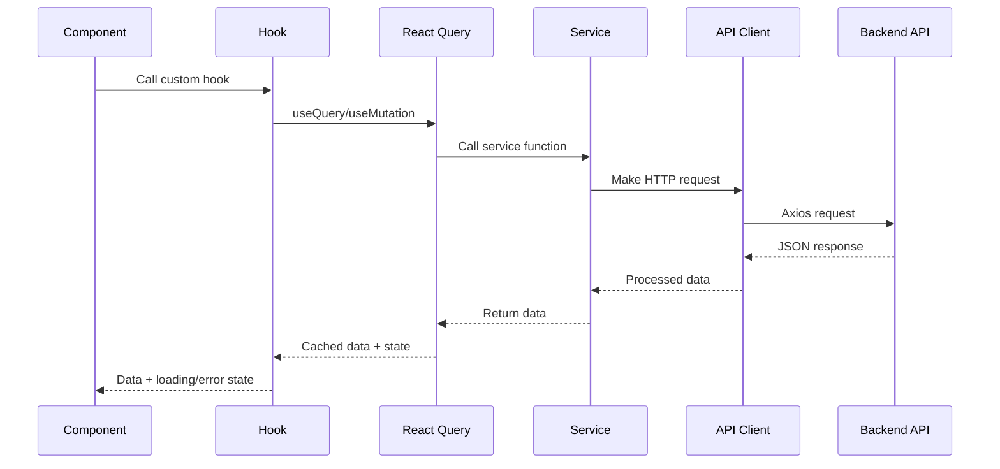

# API Integration Documentation

## 📡 Overview

This document covers all aspects of API integration in the Resource Monitoring Frontend, including service patterns, data flow, error handling, and caching strategies.

## 🏗️ API Architecture

### High-Level API Flow



### API Client Configuration

**Location**: `src/services/apiClient.ts`

```typescript
import axios from 'axios';

// Base API client configuration
const apiClient = axios.create({
  baseURL: '/',
  headers: {
    'Content-Type': 'application/json',
  },
  withCredentials: true,
  timeout: 30000, // 30 second timeout
});

// Request interceptors
apiClient.interceptors.request.use(
  (config) => {
    // Add authentication token if available
    const token = localStorage.getItem('authToken');
    if (token) {
      config.headers.Authorization = `Bearer ${token}`;
    }
    
    // Add request ID for tracking
    config.headers['X-Request-ID'] = generateRequestId();
    
    return config;
  },
  (error) => Promise.reject(error)
);

// Response interceptors
apiClient.interceptors.response.use(
  (response) => {
    // Log successful requests in development
    if (process.env.NODE_ENV === 'development') {
      console.log(`API Success: ${response.config.url}`, response.data);
    }
    return response;
  },
  (error) => {
    // Handle global error scenarios
    if (error.response?.status === 401) {
      // Redirect to login on authentication failure
      window.location.href = '/login';
      return Promise.reject(new Error('Authentication required'));
    }
    
    if (error.response?.status >= 500) {
      // Show global error notification for server errors
      showErrorNotification('Server error occurred. Please try again.');
    }
    
    // Enhanced error information
    const enhancedError = {
      ...error,
      requestId: error.config?.headers['X-Request-ID'],
      timestamp: new Date().toISOString(),
    };
    
    return Promise.reject(enhancedError);
  }
);

export default apiClient;
```

---

## 🔌 Service Layer

### Service Structure

```
src/services/api/
├── devices/
│   ├── api.ts          # API endpoint implementations
│   ├── query.ts        # React Query hooks
│   └── types.ts        # TypeScript interfaces
├── metrics/
│   ├── api.ts
│   ├── query.ts
│   └── types.ts
└── alerts/
    ├── api.ts
    ├── query.ts
    └── types.ts
```

### Devices Service

**Location**: `src/services/api/devices/`

#### API Functions (`api.ts`)

```typescript
import apiClient from '../../apiClient';
import type { DeviceData, DeviceDetailsData, DeviceProps, StatProps, AlertsProps } from './types';

// Fetch paginated devices list with filtering
export const fetchDevices = async (
  pageSize: number,
  page: number,
  sortBy: string,
  sortDirection: string,
  searchValue: string,
  filters?: Record<string, any>
): Promise<DeviceProps> => {
  const params = new URLSearchParams({
    pageSize: pageSize.toString(),
    page: page.toString(),
    sort: sortBy,
    direction: sortDirection,
  });
  
  // Add search parameter
  if (searchValue?.trim()) {
    params.append('search', searchValue.trim());
  }
  
  // Add filter parameters
  if (filters) {
    Object.entries(filters).forEach(([key, value]) => {
      if (Array.isArray(value) && value.length > 0) {
        params.append(`filter[${key}]`, value.join(','));
      } else if (value !== null && value !== undefined && value !== '') {
        params.append(`filter[${key}]`, String(value));
      }
    });
  }
  
  try {
    const response = await apiClient.get(`/api/devices?${params}`);
    
    // Validate response structure
    if (!response.data || !Array.isArray(response.data.items)) {
      throw new Error('Invalid response structure from devices API');
    }
    
    return {
      items: response.data.items,
      totalCount: response.data.totalCount || 0,
      pageInfo: {
        currentPage: page,
        pageSize,
        totalPages: Math.ceil((response.data.totalCount || 0) / pageSize),
      },
    };
  } catch (error) {
    console.error('Failed to fetch devices:', error);
    throw error;
  }
};

// Fetch individual device details
export const fetchDevice = async (id: string): Promise<DeviceDetailsData> => {
  if (!id) {
    throw new Error('Device ID is required');
  }
  
  try {
    const response = await apiClient.get(`/api/devices/${id}`);
    return response.data;
  } catch (error) {
    console.error(`Failed to fetch device ${id}:`, error);
    throw error;
  }
};

// Fetch device statistics
export const fetchStats = async (): Promise<StatProps> => {
  try {
    const response = await apiClient.get('/api/devices/stats');
    return {
      items: response.data.items || [],
      totalCount: response.data.totalCount || 0,
    };
  } catch (error) {
    console.error('Failed to fetch device stats:', error);
    throw error;
  }
};

// Fetch device alerts
export const fetchAlerts = async (deviceId: string): Promise<AlertsProps> => {
  try {
    const response = await apiClient.get(`/api/devices/${deviceId}/alerts`);
    return {
      items: response.data.items || [],
      summary: response.data.summary || {
        critical: 0,
        warning: 0,
        info: 0,
      },
    };
  } catch (error) {
    console.error(`Failed to fetch alerts for device ${deviceId}:`, error);
    throw error;
  }
};

// Fetch device interfaces
export const fetchInterfaces = async (deviceId: string): Promise<IInterfaceTableRow[]> => {
  try {
    const response = await apiClient.get(`/api/devices/${deviceId}/interfaces`);
    return response.data.items || [];
  } catch (error) {
    console.error(`Failed to fetch interfaces for device ${deviceId}:`, error);
    throw error;
  }
};
```

#### React Query Hooks (`query.ts`)

```typescript
import { useQuery, useMutation, useQueryClient } from '@tanstack/react-query';
import type { UseQueryResult, UseMutationResult } from '@tanstack/react-query';

import { 
  fetchDevices, 
  fetchDevice, 
  fetchStats, 
  fetchAlerts, 
  fetchInterfaces 
} from './api';
import type { DeviceProps, DeviceDetailsData, StatProps, AlertsProps } from './types';

// Cache times
export const CACHE_TIMES = {
  DEVICE_LIST: 5 * 60 * 1000,      // 5 minutes
  DEVICE_DETAILS: 10 * 60 * 1000,  // 10 minutes
  DEVICE_STATS: 2 * 60 * 1000,     // 2 minutes
  DEVICE_ALERTS: 1 * 60 * 1000,    // 1 minute
  DEVICE_INTERFACES: 5 * 60 * 1000, // 5 minutes
};

// Devices list query
export const useDevices = (
  pageSize: number,
  page: number,
  sortBy: string,
  sortDirection: string,
  searchValue: string,
  filters?: Record<string, any>
): UseQueryResult<DeviceProps, Error> => {
  return useQuery({
    queryKey: ['devices', { pageSize, page, sortBy, sortDirection, searchValue, filters }],
    queryFn: () => fetchDevices(pageSize, page, sortBy, sortDirection, searchValue, filters),
    staleTime: CACHE_TIMES.DEVICE_LIST,
    gcTime: CACHE_TIMES.DEVICE_LIST * 2, // Keep in cache for 10 minutes after stale
    retry: (failureCount, error) => {
      // Don't retry on 4xx errors
      if (error?.response?.status >= 400 && error?.response?.status < 500) {
        return false;
      }
      return failureCount < 3;
    },
    retryDelay: (attemptIndex) => Math.min(1000 * 2 ** attemptIndex, 30000), // Exponential backoff
  });
};

// Individual device query
export const useDevice = (id?: string): UseQueryResult<DeviceDetailsData, Error> => {
  return useQuery({
    queryKey: ['device', id],
    queryFn: () => fetchDevice(id!),
    enabled: !!id, // Only run when id is provided
    staleTime: CACHE_TIMES.DEVICE_DETAILS,
    gcTime: CACHE_TIMES.DEVICE_DETAILS * 2,
    retry: 2,
  });
};

// Device statistics query
export const useStats = (): UseQueryResult<StatProps, Error> => {
  return useQuery({
    queryKey: ['deviceStats'],
    queryFn: fetchStats,
    staleTime: CACHE_TIMES.DEVICE_STATS,
    refetchInterval: CACHE_TIMES.DEVICE_STATS, // Auto-refresh every 2 minutes
    refetchIntervalInBackground: true,
  });
};

// Device alerts query
export const useAlerts = (deviceId?: string): UseQueryResult<AlertsProps, Error> => {
  return useQuery({
    queryKey: ['deviceAlerts', deviceId],
    queryFn: () => fetchAlerts(deviceId!),
    enabled: !!deviceId,
    staleTime: CACHE_TIMES.DEVICE_ALERTS,
    refetchInterval: CACHE_TIMES.DEVICE_ALERTS, // Auto-refresh for real-time alerts
  });
};

// Device interfaces query
export const useInterfaces = (deviceId?: string) => {
  return useQuery({
    queryKey: ['deviceInterfaces', deviceId],
    queryFn: () => fetchInterfaces(deviceId!),
    enabled: !!deviceId,
    staleTime: CACHE_TIMES.DEVICE_INTERFACES,
  });
};

// Device update mutation
export const useUpdateDevice = (): UseMutationResult<
  DeviceDetailsData,
  Error,
  { id: string; updates: Partial<DeviceDetailsData> }
> => {
  const queryClient = useQueryClient();
  
  return useMutation({
    mutationFn: async ({ id, updates }) => {
      const response = await apiClient.patch(`/api/devices/${id}`, updates);
      return response.data;
    },
    onSuccess: (updatedDevice) => {
      // Invalidate and refetch device queries
      queryClient.invalidateQueries({ queryKey: ['device', updatedDevice.id] });
      queryClient.invalidateQueries({ queryKey: ['devices'] });
      
      // Optimistically update the cache
      queryClient.setQueryData(['device', updatedDevice.id], updatedDevice);
    },
    onError: (error) => {
      console.error('Failed to update device:', error);
    },
  });
};

// Bulk device operations
export const useBulkDeviceOperation = () => {
  const queryClient = useQueryClient();
  
  return useMutation({
    mutationFn: async ({ 
      operation, 
      deviceIds 
    }: { 
      operation: 'restart' | 'update' | 'delete'; 
      deviceIds: string[] 
    }) => {
      const response = await apiClient.post('/api/devices/bulk', {
        operation,
        deviceIds,
      });
      return response.data;
    },
    onSuccess: () => {
      // Invalidate all device-related queries
      queryClient.invalidateQueries({ queryKey: ['devices'] });
      queryClient.invalidateQueries({ queryKey: ['deviceStats'] });
    },
  });
};
```

#### Type Definitions (`types.ts`)

```typescript
// Base device data structure
export interface DeviceData {
  id: string;
  hostName: string;
  address: string;
  site: string;
  type: DeviceType;
  vendorName: string;
  model: string;
  osVersionString: string;
  usage: {
    cpu: number;
    memory: number;
  };
  status: 'online' | 'offline' | 'warning' | 'error';
  lastSeen: string;
  createdAt: string;
  updatedAt: string;
}

// Detailed device information
export interface DeviceDetailsData extends DeviceData {
  serialNumber?: string;
  macAddress?: string;
  uptime?: number;
  location?: {
    rack?: string;
    position?: string;
    building?: string;
    floor?: string;
  };
  configuration?: {
    managementIp?: string;
    snmpCommunity?: string;
    sshEnabled?: boolean;
    telnetEnabled?: boolean;
  };
  metrics?: {
    cpuUtilization: number;
    memoryUtilization: number;
    diskUtilization: number;
    interfaceCount: number;
  };
}

// Device types enum
export type DeviceType = 
  | 'router'
  | 'switch'
  | 'firewall'
  | 'wireless-controller'
  | 'access-point'
  | 'load-balancer'
  | 'other';

// Paginated device response
export interface DeviceProps {
  items: DeviceData[];
  totalCount: number;
  pageInfo: {
    currentPage: number;
    pageSize: number;
    totalPages: number;
    hasNextPage?: boolean;
    hasPreviousPage?: boolean;
  };
}

// Device statistics
export interface StatisticEntry {
  name: string;
  count: number;
  alerts: AlertsRows[];
}

export interface StatProps {
  items: StatisticEntry[];
  totalCount: number;
}

// Alert types
export interface AlertsRows {
  id: string;
  severity: 'critical' | 'warning' | 'info';
  message: string;
  timestamp: string;
  acknowledged: boolean;
  deviceId: string;
}

export interface AlertsProps {
  items: AlertsRows[];
  summary: {
    critical: number;
    warning: number;
    info: number;
  };
}

// Interface data
export interface IInterfaceTableRow {
  id: string;
  ifIndex: number;
  name: string;
  description?: string;
  type: string;
  speed: number;
  interfaceState: 'up' | 'down' | 'testing';
  adminState: 'up' | 'down' | 'testing';
  inBytes: number;
  outBytes: number;
  inPackets: number;
  outPackets: number;
  inErrors: number;
  outErrors: number;
  inUtilization: number;
  outUtilization: number;
  lastChange: string;
}
```

### Metrics Service

**Location**: `src/services/api/metrics/`

#### API Functions (`api.ts`)

```typescript
import apiClient from '../../apiClient';
import type { MetricsResponse, MetricFilter, TimeRange } from './types';

// Fetch device metrics with filtering
export const fetchMetrics = async (
  deviceId: string,
  filter: MetricFilter,
  timeRange: TimeRange
): Promise<MetricsResponse> => {
  const params = new URLSearchParams({
    deviceId,
    ...filter,
    from: timeRange.from,
    to: timeRange.to,
  });
  
  try {
    const response = await apiClient.get(`/api/metrics?${params}`);
    
    return {
      deviceId,
      metrics: response.data.metrics || {},
      timeRange,
      metadata: {
        totalDataPoints: response.data.totalDataPoints || 0,
        queryTime: response.data.queryTime || 0,
        cached: response.data.cached || false,
      },
    };
  } catch (error) {
    console.error(`Failed to fetch metrics for device ${deviceId}:`, error);
    throw error;
  }
};

// Fetch real-time metrics
export const fetchRealtimeMetrics = async (
  deviceIds: string[],
  metricTypes: string[]
): Promise<Record<string, any>> => {
  try {
    const response = await apiClient.post('/api/metrics/realtime', {
      deviceIds,
      metricTypes,
    });
    return response.data;
  } catch (error) {
    console.error('Failed to fetch real-time metrics:', error);
    throw error;
  }
};

// Fetch historical metrics with aggregation
export const fetchHistoricalMetrics = async (
  deviceId: string,
  metricType: string,
  timeRange: TimeRange,
  aggregation: 'avg' | 'max' | 'min' | 'sum' = 'avg',
  interval: string = '1h'
): Promise<any> => {
  try {
    const response = await apiClient.get(`/api/metrics/historical/${deviceId}`, {
      params: {
        metricType,
        from: timeRange.from,
        to: timeRange.to,
        aggregation,
        interval,
      },
    });
    return response.data;
  } catch (error) {
    console.error('Failed to fetch historical metrics:', error);
    throw error;
  }
};
```

#### React Query Hooks (`query.ts`)

```typescript
import { useQuery } from '@tanstack/react-query';
import { fetchMetrics, fetchRealtimeMetrics, fetchHistoricalMetrics } from './api';

// Standard metrics query
export const useMetrics = (
  deviceId: string,
  filter: MetricFilter,
  timeRange: TimeRange
) => {
  return useQuery({
    queryKey: ['metrics', deviceId, filter, timeRange],
    queryFn: () => fetchMetrics(deviceId, filter, timeRange),
    enabled: !!deviceId,
    staleTime: 30 * 1000, // 30 seconds for metrics
    refetchInterval: 60 * 1000, // Refetch every minute
    retry: 2,
  });
};

// Real-time metrics with shorter refresh
export const useRealtimeMetrics = (
  deviceIds: string[],
  metricTypes: string[],
  enabled: boolean = true
) => {
  return useQuery({
    queryKey: ['realtimeMetrics', deviceIds, metricTypes],
    queryFn: () => fetchRealtimeMetrics(deviceIds, metricTypes),
    enabled: enabled && deviceIds.length > 0,
    staleTime: 15 * 1000, // 15 seconds
    refetchInterval: 30 * 1000, // Refetch every 30 seconds
    refetchIntervalInBackground: true,
  });
};

// Historical metrics for analysis
export const useHistoricalMetrics = (
  deviceId: string,
  metricType: string,
  timeRange: TimeRange,
  aggregation: 'avg' | 'max' | 'min' | 'sum' = 'avg',
  interval: string = '1h'
) => {
  return useQuery({
    queryKey: ['historicalMetrics', deviceId, metricType, timeRange, aggregation, interval],
    queryFn: () => fetchHistoricalMetrics(deviceId, metricType, timeRange, aggregation, interval),
    enabled: !!deviceId && !!metricType,
    staleTime: 5 * 60 * 1000, // 5 minutes for historical data
    retry: 1,
  });
};
```

---

## 🔄 React Query Patterns

### Cache Configuration

```typescript
// Global query client configuration
const queryClient = new QueryClient({
  defaultOptions: {
    queries: {
      // Global defaults
      staleTime: 5 * 60 * 1000, // 5 minutes
      gcTime: 10 * 60 * 1000,   // 10 minutes (previously cacheTime)
      retry: (failureCount, error) => {
        // Custom retry logic
        if (error?.response?.status === 404) return false;
        if (error?.response?.status >= 400 && error?.response?.status < 500) return false;
        return failureCount < 3;
      },
      retryDelay: (attemptIndex) => Math.min(1000 * 2 ** attemptIndex, 30000),
    },
    mutations: {
      retry: 1,
      onError: (error) => {
        console.error('Mutation error:', error);
      },
    },
  },
});
```

### Cache Invalidation Strategies

```typescript
// Invalidation on data mutations
const updateDeviceMutation = useMutation({
  mutationFn: updateDevice,
  onSuccess: (updatedDevice) => {
    // Specific cache updates
    queryClient.setQueryData(['device', updatedDevice.id], updatedDevice);
    
    // Invalidate related queries
    queryClient.invalidateQueries({ queryKey: ['devices'] });
    queryClient.invalidateQueries({ queryKey: ['deviceStats'] });
    
    // Partial updates for list data
    queryClient.setQueriesData(
      { queryKey: ['devices'] },
      (oldData: DeviceProps | undefined) => {
        if (!oldData) return oldData;
        
        return {
          ...oldData,
          items: oldData.items.map(device =>
            device.id === updatedDevice.id ? updatedDevice : device
          ),
        };
      }
    );
  },
});

// Background refetching for real-time data
useEffect(() => {
  const interval = setInterval(() => {
    queryClient.invalidateQueries({ 
      queryKey: ['realtimeMetrics'],
      exact: false 
    });
  }, 30000); // Every 30 seconds
  
  return () => clearInterval(interval);
}, [queryClient]);
```

### Optimistic Updates

```typescript
const useOptimisticDeviceUpdate = () => {
  const queryClient = useQueryClient();
  
  return useMutation({
    mutationFn: updateDevice,
    onMutate: async ({ id, updates }) => {
      // Cancel outgoing refetches
      await queryClient.cancelQueries({ queryKey: ['device', id] });
      
      // Snapshot the previous value
      const previousDevice = queryClient.getQueryData(['device', id]);
      
      // Optimistically update the cache
      queryClient.setQueryData(['device', id], (old: DeviceDetailsData) => ({
        ...old,
        ...updates,
        updatedAt: new Date().toISOString(),
      }));
      
      // Return context with previous data
      return { previousDevice };
    },
    onError: (error, variables, context) => {
      // Rollback on error
      if (context?.previousDevice) {
        queryClient.setQueryData(['device', variables.id], context.previousDevice);
      }
    },
    onSettled: (data, error, variables) => {
      // Always refetch after mutation
      queryClient.invalidateQueries({ queryKey: ['device', variables.id] });
    },
  });
};
```

---

## 🛡️ Error Handling

### Error Types and Handling

```typescript
// Custom error types
export class APIError extends Error {
  constructor(
    message: string,
    public status: number,
    public code: string,
    public details?: any
  ) {
    super(message);
    this.name = 'APIError';
  }
}

export class NetworkError extends Error {
  constructor(message: string, public originalError: Error) {
    super(message);
    this.name = 'NetworkError';
  }
}

export class ValidationError extends Error {
  constructor(
    message: string,
    public field: string,
    public value: any
  ) {
    super(message);
    this.name = 'ValidationError';
  }
}

// Error handling utility
export const handleAPIError = (error: any): APIError => {
  if (error.response) {
    // Server responded with error status
    return new APIError(
      error.response.data?.message || 'Server error occurred',
      error.response.status,
      error.response.data?.code || 'SERVER_ERROR',
      error.response.data
    );
  } else if (error.request) {
    // Network error
    return new NetworkError('Network connection failed', error);
  } else {
    // Request setup error
    return new APIError('Request configuration error', 0, 'REQUEST_ERROR');
  }
};

// Global error boundary for API errors
export const APIErrorBoundary: React.FC<{ children: React.ReactNode }> = ({ children }) => {
  return (
    <ErrorBoundary
      fallback={({ error, resetError }) => (
        <ErrorState
          title="Something went wrong"
          text={error instanceof APIError ? error.message : 'An unexpected error occurred'}
          onRetry={resetError}
        />
      )}
      onError={(error) => {
        // Log to monitoring service
        console.error('API Error Boundary caught error:', error);
      }}
    >
      {children}
    </ErrorBoundary>
  );
};
```

### Component-Level Error Handling

```typescript
const DevicesTable: React.FC = () => {
  const { 
    data, 
    isLoading, 
    error, 
    refetch,
    isRefetching 
  } = useDevices(pageSize, page, sortBy, sortDirection, searchValue);
  
  // Handle different error scenarios
  if (error) {
    if (error instanceof NetworkError) {
      return (
        <ErrorState
          title="Connection Problem"
          text="Unable to connect to the server. Please check your internet connection."
          onRetry={() => refetch()}
        />
      );
    }
    
    if (error instanceof APIError && error.status === 403) {
      return (
        <ErrorState
          title="Access Denied"
          text="You don't have permission to view device information."
        />
      );
    }
    
    return (
      <ErrorState
        title="Failed to Load Devices"
        text={error.message}
        onRetry={() => refetch()}
      />
    );
  }
  
  // Show loading state
  if (isLoading) {
    return <DevicesTableSkeleton />;
  }
  
  // Show refreshing indicator
  if (isRefetching) {
    return (
      <div className="table-container">
        <div className="refresh-indicator">Refreshing...</div>
        <TableWrapper data={data?.items || []} columns={columns} />
      </div>
    );
  }
  
  return <TableWrapper data={data?.items || []} columns={columns} />;
};
```

---

## 📊 Performance Optimization

### Query Optimization Patterns

```typescript
// Selective data fetching
const useDeviceBasicInfo = (id: string) => {
  return useQuery({
    queryKey: ['device', id, 'basic'],
    queryFn: async () => {
      const response = await apiClient.get(`/api/devices/${id}`, {
        params: { fields: 'id,hostName,address,status,type' }
      });
      return response.data;
    },
    select: (data) => ({
      id: data.id,
      name: data.hostName,
      ip: data.address,
      status: data.status,
      type: data.type,
    }),
  });
};

// Infinite queries for large datasets
const useInfiniteDevices = (filters: any) => {
  return useInfiniteQuery({
    queryKey: ['devices', 'infinite', filters],
    queryFn: ({ pageParam = 1 }) => 
      fetchDevices(50, pageParam, 'hostName', 'asc', '', filters),
    getNextPageParam: (lastPage) => {
      const { currentPage, totalPages } = lastPage.pageInfo;
      return currentPage < totalPages ? currentPage + 1 : undefined;
    },
    initialPageParam: 1,
  });
};

// Prefetching related data
const usePrefetchDeviceDetails = () => {
  const queryClient = useQueryClient();
  
  return useCallback((deviceId: string) => {
    queryClient.prefetchQuery({
      queryKey: ['device', deviceId],
      queryFn: () => fetchDevice(deviceId),
      staleTime: 5 * 60 * 1000,
    });
  }, [queryClient]);
};

// Parallel queries
const useDeviceDashboardData = (deviceId: string) => {
  const queries = useQueries({
    queries: [
      {
        queryKey: ['device', deviceId],
        queryFn: () => fetchDevice(deviceId),
      },
      {
        queryKey: ['deviceAlerts', deviceId],
        queryFn: () => fetchAlerts(deviceId),
      },
      {
        queryKey: ['deviceInterfaces', deviceId],
        queryFn: () => fetchInterfaces(deviceId),
      },
    ],
  });
  
  return {
    device: queries[0],
    alerts: queries[1],
    interfaces: queries[2],
    isLoading: queries.some(query => query.isLoading),
    error: queries.find(query => query.error)?.error,
  };
};
```

### Data Transformation and Caching

```typescript
// Efficient data transformations
const useProcessedDevices = (rawDevices: DeviceData[]) => {
  return useMemo(() => {
    return rawDevices?.map(device => ({
      ...device,
      displayName: `${device.hostName} (${device.address})`,
      statusColor: getStatusColor(device.status),
      utilizationPercent: Math.round((device.usage.cpu + device.usage.memory) / 2),
      lastSeenFormatted: formatDistanceToNow(new Date(device.lastSeen)),
    })) || [];
  }, [rawDevices]);
};

// Computed values with caching
const useDeviceStatistics = (devices: DeviceData[]) => {
  return useMemo(() => {
    const stats = devices?.reduce(
      (acc, device) => {
        acc.total += 1;
        acc.byType[device.type] = (acc.byType[device.type] || 0) + 1;
        acc.byStatus[device.status] = (acc.byStatus[device.status] || 0) + 1;
        
        if (device.usage.cpu > 80) acc.highCpuCount += 1;
        if (device.usage.memory > 80) acc.highMemoryCount += 1;
        
        return acc;
      },
      {
        total: 0,
        byType: {} as Record<string, number>,
        byStatus: {} as Record<string, number>,
        highCpuCount: 0,
        highMemoryCount: 0,
      }
    );
    
    return {
      ...stats,
      healthScore: calculateHealthScore(stats),
    };
  }, [devices]);
};
```

---

## 🧪 Testing API Integration

### Mock Service Worker Setup

```typescript
// src/tests/mocks/handlers.ts
import { http, HttpResponse } from 'msw';
import type { DeviceData, DeviceProps } from '@services/api/devices/types';

const mockDevices: DeviceData[] = [
  {
    id: '1',
    hostName: 'router-01',
    address: '192.168.1.1',
    site: 'NYC',
    type: 'router',
    vendorName: 'Cisco',
    model: 'ASR1000',
    osVersionString: 'IOS XE 16.12',
    usage: { cpu: 45, memory: 60 },
    status: 'online',
    lastSeen: new Date().toISOString(),
    createdAt: '2023-01-01T00:00:00Z',
    updatedAt: new Date().toISOString(),
  },
  // ... more mock devices
];

export const handlers = [
  // Devices list endpoint
  http.get('/api/devices', ({ request }) => {
    const url = new URL(request.url);
    const page = parseInt(url.searchParams.get('page') || '1');
    const pageSize = parseInt(url.searchParams.get('pageSize') || '50');
    const search = url.searchParams.get('search');
    
    let filteredDevices = mockDevices;
    
    // Apply search filter
    if (search) {
      filteredDevices = mockDevices.filter(device =>
        device.hostName.toLowerCase().includes(search.toLowerCase()) ||
        device.address.includes(search)
      );
    }
    
    // Apply pagination
    const startIndex = (page - 1) * pageSize;
    const endIndex = startIndex + pageSize;
    const paginatedDevices = filteredDevices.slice(startIndex, endIndex);
    
    const response: DeviceProps = {
      items: paginatedDevices,
      totalCount: filteredDevices.length,
      pageInfo: {
        currentPage: page,
        pageSize,
        totalPages: Math.ceil(filteredDevices.length / pageSize),
      },
    };
    
    return HttpResponse.json(response);
  }),
  
  // Individual device endpoint
  http.get('/api/devices/:id', ({ params }) => {
    const device = mockDevices.find(d => d.id === params.id);
    if (!device) {
      return new HttpResponse(null, { status: 404 });
    }
    return HttpResponse.json(device);
  }),
  
  // Error scenarios for testing
  http.get('/api/devices/error-test', () => {
    return new HttpResponse(null, { status: 500 });
  }),
  
  // Delayed response for loading state testing
  http.get('/api/devices/slow', async () => {
    await new Promise(resolve => setTimeout(resolve, 2000));
    return HttpResponse.json({ items: mockDevices, totalCount: mockDevices.length });
  }),
];
```

### API Integration Tests

```typescript
// src/services/api/devices/__tests__/query.test.ts
import { renderHook, waitFor } from '@testing-library/react';
import { QueryClient, QueryClientProvider } from '@tanstack/react-query';
import { server } from '@tests/mocks/server';
import { http, HttpResponse } from 'msw';

import { useDevices, useDevice } from '../query';

const createWrapper = () => {
  const queryClient = new QueryClient({
    defaultOptions: {
      queries: { retry: false },
      mutations: { retry: false },
    },
  });
  
  return ({ children }: { children: React.ReactNode }) => (
    <QueryClientProvider client={queryClient}>
      {children}
    </QueryClientProvider>
  );
};

describe('useDevices', () => {
  it('fetches devices successfully', async () => {
    const { result } = renderHook(
      () => useDevices(10, 1, 'hostName', 'asc', ''),
      { wrapper: createWrapper() }
    );
    
    expect(result.current.isLoading).toBe(true);
    
    await waitFor(() => {
      expect(result.current.isSuccess).toBe(true);
    });
    
    expect(result.current.data?.items).toHaveLength(2);
    expect(result.current.data?.items[0].hostName).toBe('router-01');
  });
  
  it('handles API errors', async () => {
    server.use(
      http.get('/api/devices', () => {
        return new HttpResponse(null, { status: 500 });
      })
    );
    
    const { result } = renderHook(
      () => useDevices(10, 1, 'hostName', 'asc', ''),
      { wrapper: createWrapper() }
    );
    
    await waitFor(() => {
      expect(result.current.isError).toBe(true);
    });
    
    expect(result.current.error).toBeDefined();
  });
  
  it('applies search filters', async () => {
    const { result } = renderHook(
      () => useDevices(10, 1, 'hostName', 'asc', 'router'),
      { wrapper: createWrapper() }
    );
    
    await waitFor(() => {
      expect(result.current.isSuccess).toBe(true);
    });
    
    expect(result.current.data?.items).toHaveLength(1);
    expect(result.current.data?.items[0].hostName).toContain('router');
  });
});

describe('useDevice', () => {
  it('fetches individual device', async () => {
    const { result } = renderHook(
      () => useDevice('1'),
      { wrapper: createWrapper() }
    );
    
    await waitFor(() => {
      expect(result.current.isSuccess).toBe(true);
    });
    
    expect(result.current.data?.id).toBe('1');
    expect(result.current.data?.hostName).toBe('router-01');
  });
  
  it('handles 404 errors', async () => {
    const { result } = renderHook(
      () => useDevice('nonexistent'),
      { wrapper: createWrapper() }
    );
    
    await waitFor(() => {
      expect(result.current.isError).toBe(true);
    });
    
    expect(result.current.error?.response?.status).toBe(404);
  });
});
```

This comprehensive API documentation covers all aspects of API integration in the Resource Monitoring Frontend, from basic service setup to advanced patterns like optimistic updates and error handling. It provides developers with clear patterns to follow and examples to reference when working with the API layer.