# System Architecture Documentation

## 📐 Architecture Overview

The Resource Monitoring Frontend follows a modern React architecture with clear separation of concerns and scalable patterns.

## 🏗️ Architectural Principles

### 1. Layered Architecture

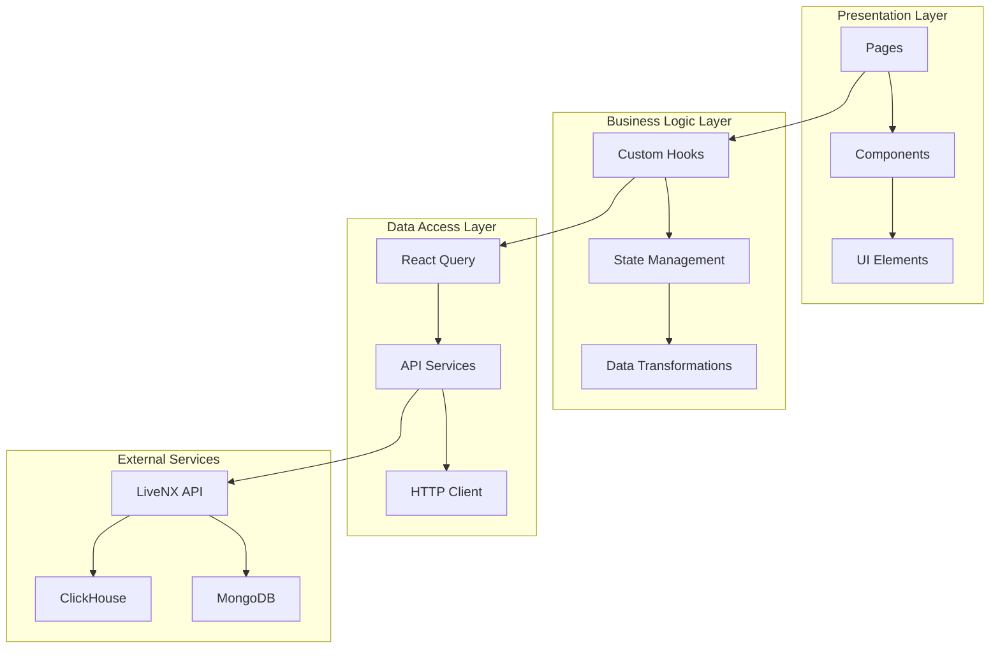

### 2. Component Architecture

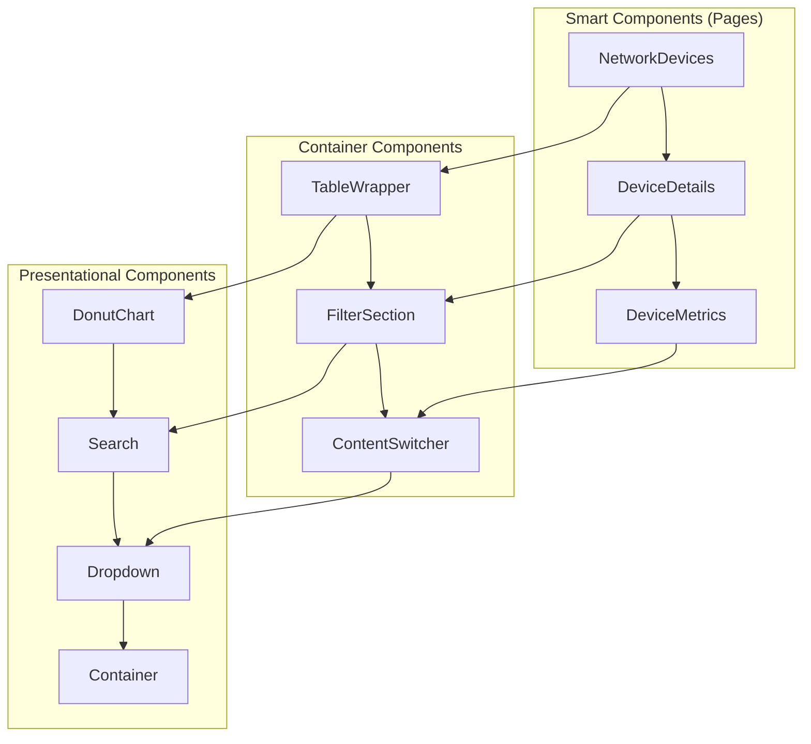

### 3. Data Flow Architecture

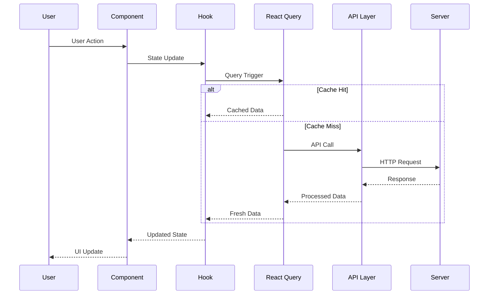

## 🧩 Component Design Patterns

### 1. Composition Pattern

Components are designed to be composable and reusable:

```typescript
// Container component that accepts any children
<Container isVertical spacing={{ top: 16 }}>
  <BreadcrumbNavigation />
  <FilterSection />
  <TableWrapper />
</Container>
```

### 2. Render Props Pattern

For complex components with shared logic:

```typescript
<ResizableContainer>
  {({ width }) => (
    <TypeWidgetGrid 
      widgets={widgets}
      visibleCount={calculateVisibleWidgets(width)}
    />
  )}
</ResizableContainer>
```

### 3. Custom Hook Pattern

Business logic separated from presentation:

```typescript
// Custom hook for pagination
function usePagination() {
  const [searchParams, setSearchParams] = useSearchParams();
  
  const page = useMemo(() => 
    parseInt(searchParams.get('page') || '1'), 
    [searchParams]
  );
  
  const setPage = useCallback((newPage: number) => {
    // Update URL parameters
  }, []);
  
  return { page, setPage };
}

// Usage in component
function DevicesTable() {
  const { page, setPage } = usePagination();
  // Component only handles rendering
}
```

## 📊 State Management Architecture

### 1. State Distribution

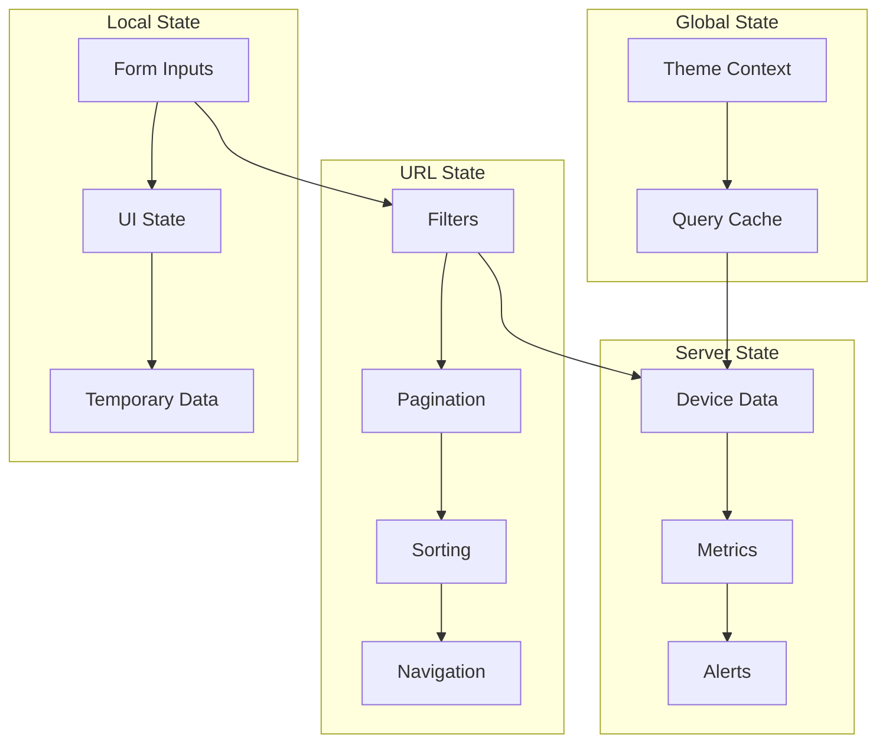

### 2. URL State Management

Most application state lives in URL parameters for persistence and shareability:

```typescript
// URL structure examples
/resource-monitoring/devices?page=2&pageSize=50&sort=hostName&direction=asc&search=router&vendor.contains=cisco

/resource-monitoring/devices/123?tab=interfaces

/resource-monitoring/devices/123/metrics?view=historical&from=2023-01-01&to=2023-01-31
```

### 3. React Query State Management

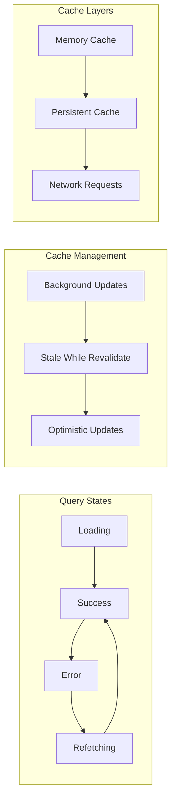

## 🔄 Data Flow Patterns

### 1. Unidirectional Data Flow

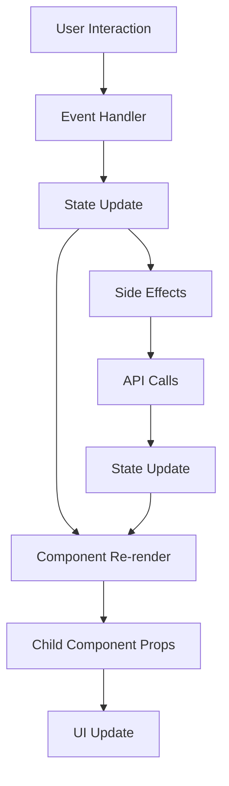

### 2. Filter System Data Flow

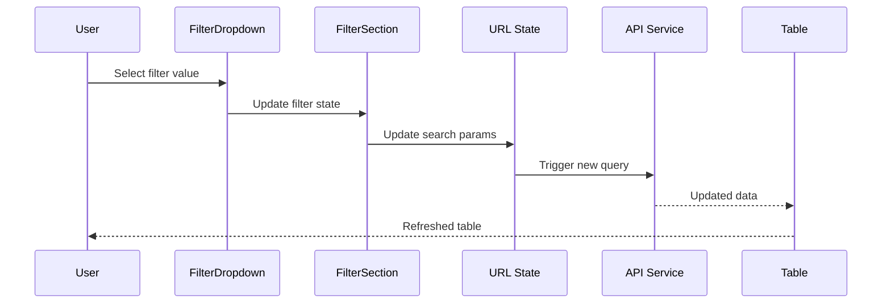

### 3. Pagination Data Flow

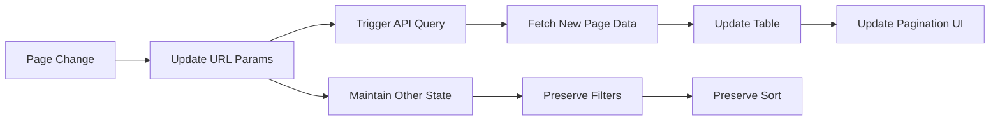

## 🎯 Performance Architecture

### 1. Caching Strategy

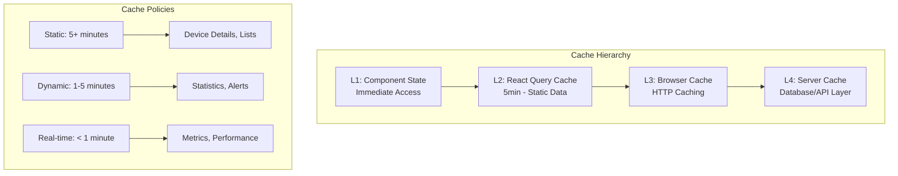

### 2. Bundle Architecture

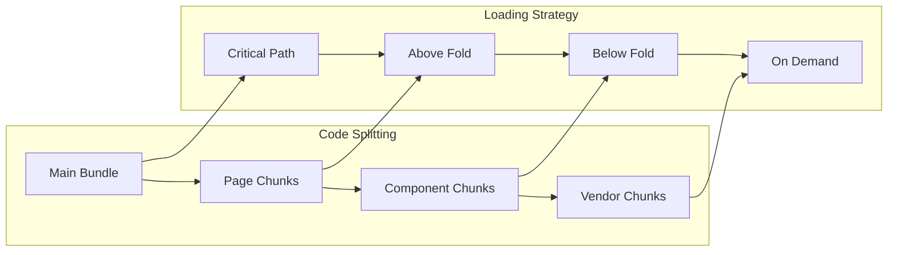

### 3. Rendering Optimization

```typescript
// Component memoization patterns
const ExpensiveComponent = React.memo(({ data, onAction }) => {
  const processedData = useMemo(() => 
    data.map(item => expensiveTransformation(item)), 
    [data]
  );
  
  const handleClick = useCallback((item) => {
    onAction(item);
  }, [onAction]);
  
  return (
    <div>
      {processedData.map(item => (
        <Item key={item.id} data={item} onClick={handleClick} />
      ))}
    </div>
  );
});

// Virtualization for large lists
const VirtualizedTable = ({ data }) => {
  const [visibleItems, setVisibleItems] = useState([]);
  
  useEffect(() => {
    // Calculate visible items based on scroll position
    const visible = calculateVisibleItems(data, scrollPosition);
    setVisibleItems(visible);
  }, [data, scrollPosition]);
  
  return (
    <div className="virtualized-container">
      {visibleItems.map(item => <TableRow key={item.id} data={item} />)}
    </div>
  );
};
```

## 🔌 Integration Architecture

### 1. API Integration Layers

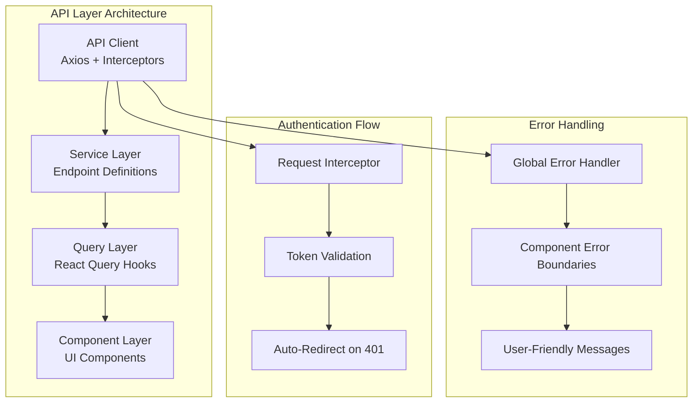

### 2. External Service Integration

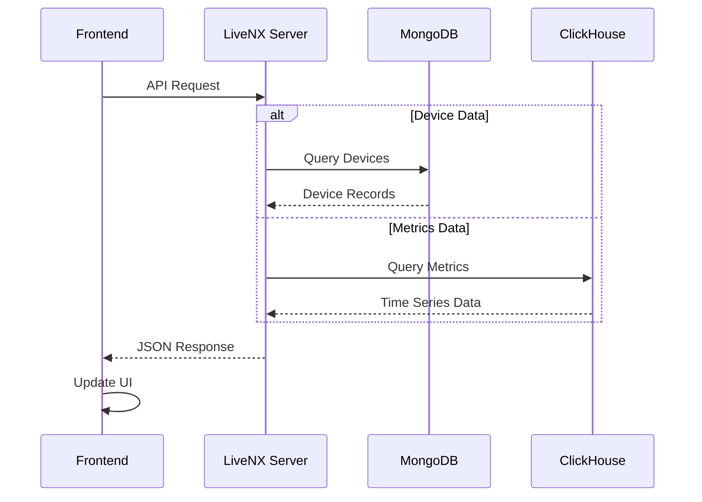

### 3. Development Environment Integration

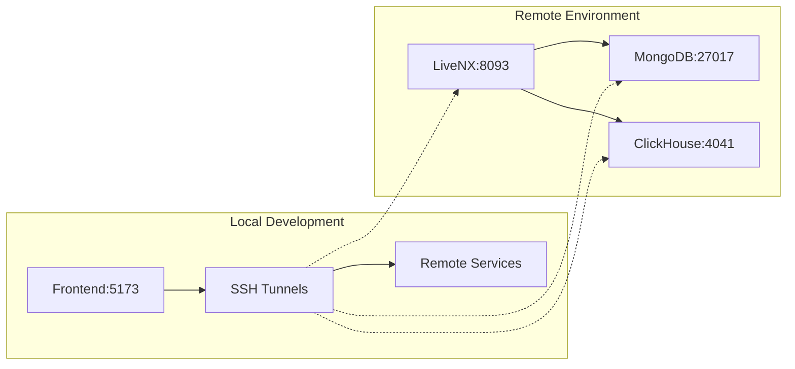

## 🔧 Build & Deployment Architecture

### 1. Build Pipeline

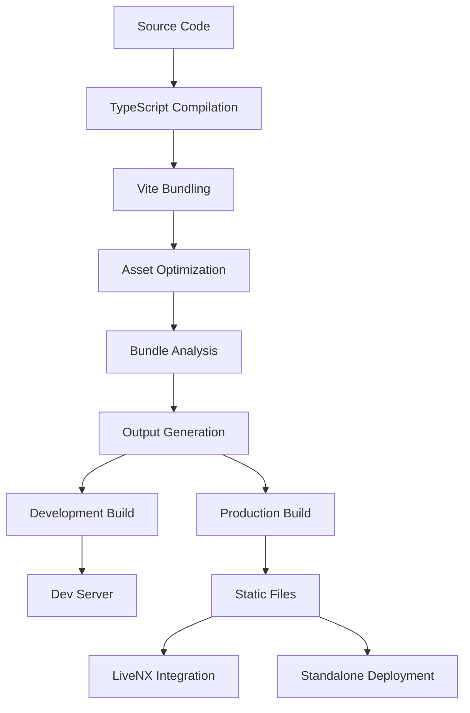

### 2. Module Architecture

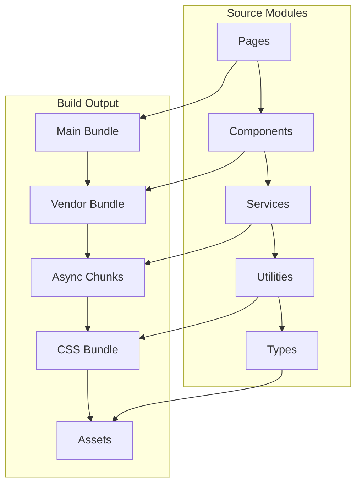

## 🧪 Testing Architecture

### 1. Testing Strategy

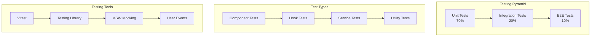

### 2. Test Environment Architecture

```typescript
// Test setup with providers
export const TestProviders = ({ children }: { children: React.ReactNode }) => {
  const queryClient = new QueryClient({
    defaultOptions: {
      queries: { retry: false, staleTime: 0 },
      mutations: { retry: false },
    },
  });

  return (
    <QueryClientProvider client={queryClient}>
      <BrowserRouter>
        <ThemeProvider>
          {children}
        </ThemeProvider>
      </BrowserRouter>
    </QueryClientProvider>
  );
};

// Mock service worker setup
export const server = setupServer(
  http.get('/api/devices', () => HttpResponse.json(mockDevices)),
  http.get('/api/metrics', () => HttpResponse.json(mockMetrics)),
);
```

## 📈 Scalability Considerations

### 1. Horizontal Scaling

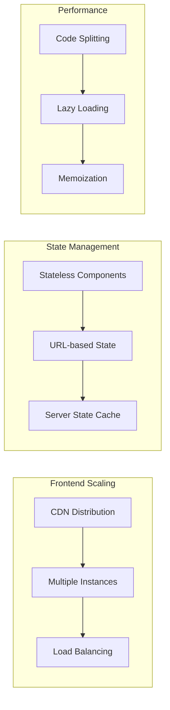

### 2. Feature Scaling

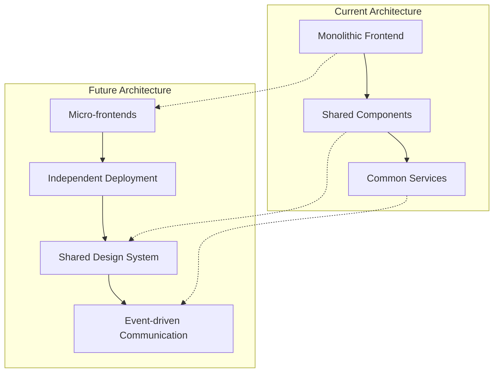

## 🔒 Security Architecture

### 1. Authentication Flow

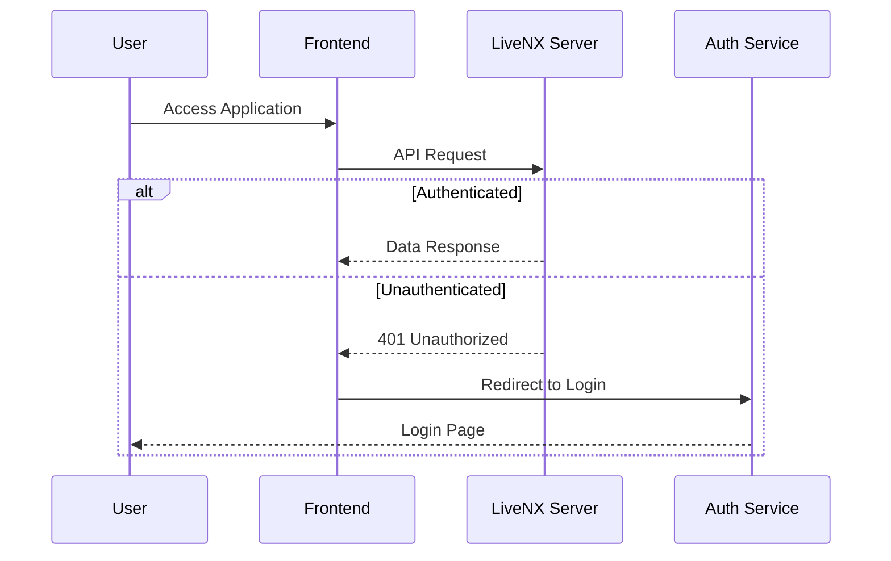

### 2. Data Security

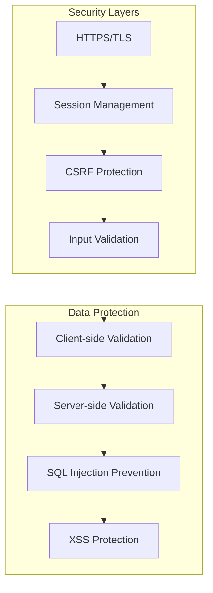

This architecture documentation provides a comprehensive view of how the Resource Monitoring Frontend is structured, how data flows through the system, and how different components interact with each other. It serves as a foundation for understanding the system's design decisions and can guide future development efforts.