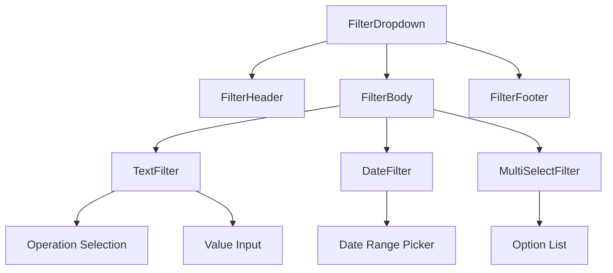

# Component Library Documentation

## 📚 Overview

This document provides comprehensive documentation for all components in the Resource Monitoring Frontend application. Components are organized by category and include usage examples, props documentation, and implementation details.

## 🗂️ Component Categories

- [Layout Components](#layout-components)
- [Navigation Components](#navigation-components)
- [Data Display Components](#data-display-components)
- [Input Components](#input-components)
- [Feedback Components](#feedback-components)
- [Chart Components](#chart-components)
- [Specialized Components](#specialized-components)

---

## 🏗️ Layout Components

### Container

**Purpose**: Flexible layout wrapper that provides consistent spacing, alignment, and responsive behavior.

**Location**: `src/components/Container/Container.tsx`

#### Props Interface
```typescript
interface ContainerProps {
  children: React.ReactNode;
  isVertical?: boolean;
  isFullWidth?: boolean;
  isWrapping?: boolean;
  justify?: 'start' | 'end' | 'center' | 'space-between' | 'space-around';
  align?: 'start' | 'end' | 'center' | 'stretch';
  gap?: number;
  spacing?: {
    top?: number;
    right?: number;
    bottom?: number;
    left?: number;
  };
  margin?: {
    top?: number;
    right?: number;
    bottom?: number;
    left?: number;
  };
  className?: string;
  style?: React.CSSProperties;
}
```

#### Usage Examples

```tsx
// Basic vertical container
<Container isVertical>
  <h1>Title</h1>
  <p>Content</p>
</Container>

// Horizontal layout with spacing
<Container justify="space-between" align="center" spacing={{ left: 16, right: 16 }}>
  <div>Left Content</div>
  <div>Right Content</div>
</Container>

// Grid-like layout with wrapping
<Container isWrapping gap={16} spacing={{ top: 24 }}>
  <Card />
  <Card />
  <Card />
</Container>
```

#### Implementation Details
```typescript
const Container: React.FC<ContainerProps> = ({
  children,
  isVertical = false,
  isFullWidth = true,
  isWrapping = false,
  justify = 'start',
  align = 'start',
  gap = 0,
  spacing = {},
  margin = {},
  className = '',
  style = {},
}) => {
  const containerStyle: React.CSSProperties = {
    display: 'flex',
    flexDirection: isVertical ? 'column' : 'row',
    justifyContent: justify,
    alignItems: align,
    width: isFullWidth ? '100%' : 'auto',
    flexWrap: isWrapping ? 'wrap' : 'nowrap',
    gap: gap ? `${gap}px` : undefined,
    paddingTop: spacing.top ? `${spacing.top}px` : undefined,
    paddingRight: spacing.right ? `${spacing.right}px` : undefined,
    paddingBottom: spacing.bottom ? `${spacing.bottom}px` : undefined,
    paddingLeft: spacing.left ? `${spacing.left}px` : undefined,
    marginTop: margin.top ? `${margin.top}px` : undefined,
    marginRight: margin.right ? `${margin.right}px` : undefined,
    marginBottom: margin.bottom ? `${margin.bottom}px` : undefined,
    marginLeft: margin.left ? `${margin.left}px` : undefined,
    ...style,
  };

  return (
    <div className={className} style={containerStyle}>
      {children}
    </div>
  );
};
```

### ResizableContainer

**Purpose**: Container that adapts its content based on available width, useful for responsive widget layouts.

**Location**: `src/components/ResizableContainer/ResizableContainer.tsx`

```tsx
interface ResizableContainerProps {
  children: (dimensions: { width: number; height: number }) => React.ReactNode;
  style?: React.CSSProperties;
}

// Usage
<ResizableContainer style={{ minHeight: '200px' }}>
  {({ width }) => (
    <WidgetGrid
      widgets={widgets}
      visibleCount={Math.floor(width / MIN_WIDGET_WIDTH)}
    />
  )}
</ResizableContainer>
```

---

## 🧭 Navigation Components

### Navbar

**Purpose**: Top navigation bar with branding, navigation links, and user actions.

**Location**: `src/components/Navbar/Navbar.tsx`

#### Features
- LiveNX integration link
- Theme toggle (light/dark mode)
- Settings dropdown menu
- Responsive design

#### Implementation
```tsx
const Navbar: React.FC = () => {
  const { theme, toggleTheme } = useTheme();

  return (
    <Container justify="space-between" className="navbar">
      <Container isFullWidth={false} className="navbar__navigation">
        <Menu size={20} aria-label="Hamburger" className="navbar_menu" />
        <Link to="/resource-monitoring" className="navbar__title">
          Resource Monitoring
        </Link>
        <LinkButton href="/" text="LiveNX" type="tertiary" size="small">
          LiveNX
        </LinkButton>
      </Container>
      
      <Container isFullWidth={false} className="navbar-actions">
        <div className="overflow-menu" tabIndex={0}>
          <Settings size={20} aria-label="Settings" />
          <div className="overflow-menu-items">
            <button onClick={toggleTheme}>
              Toggle Theme ({theme})
            </button>
          </div>
        </div>
      </Container>
    </Container>
  );
};
```

### BreadcrumbNavigation

**Purpose**: Dynamic breadcrumb navigation that automatically generates based on the current route.

**Location**: `src/components/BreadcrumbNavigation/BreadcrumbNavigation.tsx`

#### Features
- Auto-generates from URL structure
- Maintains pagination state in links
- Handles device name resolution
- Responsive truncation

#### Usage
```tsx
// Automatically used in page components
<Container isVertical className="page-header">
  <BreadcrumbNavigation />
  <h1 className="page-title">Page Title</h1>
</Container>
```

#### Implementation Details
```typescript
const BreadcrumbNavigation: React.FC = () => {
  const location = useLocation();
  const { id } = useParams<{ id: string }>();
  const { data: device } = useDevice(id);
  const { page, pageSize } = usePagination();

  const pathnames = location.pathname.split('/').filter(x => x);
  const visiblePathnames = pathnames.slice(1); // Remove 'resource-monitoring'

  const pathToLabel = (path: string): string => {
    if (path === 'resource-monitoring') return 'Resource Monitoring';
    if (path === 'devices') return 'Devices';
    if (path === 'metrics') return 'Metrics';
    if (path === id && device?.hostname) return device.hostname;
    return path;
  };

  return (
    <Container justify="space-between" className="breadcrumb__navigation">
      <Breadcrumb>
        {visiblePathnames.map((value, index) => {
          const to = `/${pathnames.slice(0, index + 2).join('/')}`;
          const isLast = index === visiblePathnames.length - 1;
          
          return (
            <BreadcrumbItem key={to}>
              {isLast ? (
                <span>{pathToLabel(value)}</span>
              ) : (
                <Link to={to}>{pathToLabel(value)}</Link>
              )}
            </BreadcrumbItem>
          );
        })}
      </Breadcrumb>
    </Container>
  );
};
```

---

## 📊 Data Display Components

### TableWrapper

**Purpose**: Comprehensive table component with sorting, pagination, filtering, and custom cell renderers.

**Location**: `src/components/TableWrapper/TableWrapper.tsx`

#### Props Interface
```typescript
interface TableWrapperProps<T> {
  data: T[];
  columns: Column<T>[];
  getRowId: (row: T) => string;
  customRenderers?: CustomTableCellRenderer<T>;
  isLoading?: boolean;
  error?: Error | null;
  onRowClick?: (row: T) => void;
  emptyState?: React.ReactNode;
}

interface Column<T> {
  key: keyof T;
  label: string;
  width?: string;
  align?: 'left' | 'center' | 'right';
  sortable?: boolean;
}

type CustomTableCellRenderer<T> = {
  [K in keyof T]?: React.ComponentType<{
    value: T[K];
    row: T;
    column: Column<T>;
  }>;
};
```

#### Usage Example
```tsx
// Define columns
const deviceColumns: Column<DeviceData>[] = [
  {
    key: 'hostName',
    label: 'Device',
    width: '15%',
    sortable: true,
  },
  {
    key: 'address',
    label: 'IP Address',
    sortable: true,
  },
  {
    key: 'usage',
    label: 'CPU/Memory',
    align: 'left',
  },
];

// Define custom renderers
const customRenderers: CustomTableCellRenderer<DeviceData> = {
  usage: ({ value, row }) => (
    <ProgressIndicator 
      cpu={row.cpuUsage} 
      memory={row.memoryUsage} 
    />
  ),
  status: ({ value }) => (
    <StatusBadge status={value} />
  ),
};

// Use the table
<TableWrapper
  data={devices}
  columns={deviceColumns}
  getRowId={row => row.id}
  customRenderers={customRenderers}
  onRowClick={device => navigate(`/devices/${device.id}`)}
  isLoading={isLoading}
  error={error}
/>
```

#### Built-in Features

**Sorting**: Click column headers to sort data
```typescript
const useSorter = (defaultSort: string, columns: Column<any>[]) => {
  const [searchParams, setSearchParams] = useSearchParams();
  
  const sortedBy = searchParams.get('sort') || defaultSort;
  const sortDirection = searchParams.get('direction') || 'asc';
  
  const setSortBy = (column: string) => {
    const newParams = new URLSearchParams(searchParams);
    newParams.set('sort', column);
    newParams.set('direction', 
      sortedBy === column && sortDirection === 'asc' ? 'desc' : 'asc'
    );
    setSearchParams(newParams);
  };
  
  return { sortedBy, sortDirection, setSortBy };
};
```

**Pagination**: Built-in pagination controls
```typescript
const usePagination = () => {
  const [searchParams, setSearchParams] = useSearchParams();
  
  const page = parseInt(searchParams.get('page') || '1');
  const pageSize = parseInt(searchParams.get('pageSize') || '50');
  
  const setPage = (newPage: number) => {
    const newParams = new URLSearchParams(searchParams);
    newParams.set('page', newPage.toString());
    setSearchParams(newParams);
  };
  
  return { page, pageSize, setPage, setPageSize };
};
```

### TypeWidget

**Purpose**: Summary widget displaying device type statistics with alerts.

**Location**: `src/components/TypeWidget/TypeWidget.tsx`

#### Props Interface
```typescript
interface TypeWidgetProps<T> {
  name: string;
  count: number;
  rows: T[];
  onClick?: () => void;
}

interface AlertsRows {
  severity: 'critical' | 'warning' | 'info';
  count: number;
  message: string;
}
```

#### Usage
```tsx
<TypeWidget<AlertsRows>
  name="Routers"
  count={25}
  rows={[
    { severity: 'critical', count: 2, message: 'High CPU usage' },
    { severity: 'warning', count: 5, message: 'Memory warnings' },
  ]}
  onClick={() => filterByDeviceType('router')}
/>
```

---

## 📝 Input Components

### FilterDropdown

**Purpose**: Advanced filtering component that supports different data types and operations.

**Location**: `src/components/FilterDropdown/FilterDropdown.tsx`

#### Architecture



#### Supported Filter Types

**Text Filter**:
```typescript
interface TextFilterProps {
  value: string[];
  onChange: (value: string[]) => void;
  operatorVal: string;
  onOperatorChange: (op: string) => void;
  config?: {
    operations?: string[];
    options?: string[];
    label?: string;
  };
}

// Usage
<FilterDropdown
  type="text"
  urlKey="deviceName"
  defaultValue={[]}
  extraProps={{
    filterKey: 'deviceName',
    operation: 'contains',
    config: {
      operations: ['contains', 'equals', 'startsWith'],
      label: 'Device Name',
    }
  }}
/>
```

**Date Filter**:
```typescript
interface DateFilterProps {
  value: string;
  onChange: (value: string) => void;
  list: { label: string; value: string }[];
}

// Usage
<FilterDropdown
  type="date"
  urlKey="dateRange"
  defaultValue="last24h"
  extraProps={{
    list: [
      { label: 'Last 24 hours', value: 'last24h' },
      { label: 'Last 7 days', value: 'last7d' },
      { label: 'Last 30 days', value: 'last30d' },
    ]
  }}
/>
```

#### Filter State Management

```typescript
// URL state pattern for filters
// Format: ?key.operation=value1,value2
// Examples:
// ?hostname.contains=router
// ?vendor.equals=cisco,juniper
// ?lastSeen.after=2023-01-01

const useFilter = <T extends FilterType>({
  type,
  defaultValue,
  urlKey,
}: UseFilterParams<T>) => {
  const [searchParams, setSearchParams] = useSearchParams();
  
  const currentValue = useMemo(() => {
    // Extract current filter value from URL
    const entries = [...searchParams.entries()];
    const matchingEntry = entries.find(([key]) => key.startsWith(urlKey));
    return matchingEntry ? parseFilterValue(matchingEntry, type) : defaultValue;
  }, [searchParams, urlKey, defaultValue, type]);
  
  const updateFilter = useCallback((newValue: FilterValueMap[T]) => {
    const newParams = new URLSearchParams(searchParams);
    updateFilterInSearchParams(urlKey, operation, newValue, newParams);
    setSearchParams(newParams);
  }, [searchParams, setSearchParams, urlKey]);
  
  return { value: currentValue, updateFilter };
};
```

### Search

**Purpose**: Search input with icon and debounced input handling.

**Location**: `src/components/Search/Search.tsx`

```tsx
interface SearchProps {
  placeholder?: string;
  onChange: (value: string) => void;
  className?: string;
  initialText?: string;
}

// Usage
<Search
  placeholder="Search devices..."
  onChange={handleSearchChange}
  initialText={initialSearchValue}
  className="device-search"
/>

// With debouncing
const handleSearchChange = (value: string) => {
  const debouncedValue = useDebouncedValue(value, 300);
  
  useEffect(() => {
    // Trigger search API call
    refetchDevices();
  }, [debouncedValue]);
};
```

### MultiSelect

**Purpose**: Multi-selection dropdown with search and filtering capabilities.

**Location**: `src/components/MultiSelect/MultiSelect.tsx`

```tsx
interface MultiSelectProps {
  options: Array<{ label: string; value: string }>;
  value: string[];
  onChange: (selected: string[]) => void;
  placeholder?: string;
  searchable?: boolean;
  maxDisplayed?: number;
}

// Usage
<MultiSelect
  options={vendorOptions}
  value={selectedVendors}
  onChange={setSelectedVendors}
  placeholder="Select vendors..."
  searchable={true}
  maxDisplayed={3}
/>
```

---

## 💬 Feedback Components

### ErrorState

**Purpose**: Standardized error display with retry capabilities.

**Location**: `src/components/ErrorState/ErrorState.tsx`

```tsx
interface ErrorStateProps {
  title: string;
  text: string;
  onRetry?: () => void;
  containerProps?: {
    spacing?: SpacingProps;
    className?: string;
  };
}

// Usage
<ErrorState
  title="Failed to load devices"
  text="Unable to connect to the server. Please check your connection and try again."
  onRetry={() => refetch()}
  containerProps={{
    spacing: { top: 32, bottom: 32 },
    className: 'error-container'
  }}
/>
```

### LoadingState

**Purpose**: Loading indicators and skeleton screens.

```tsx
// Skeleton loading for tables
const TableSkeleton = () => (
  <div className="table-skeleton">
    {Array.from({ length: 10 }).map((_, index) => (
      <div key={index} className="skeleton-row">
        <div className="skeleton-cell" />
        <div className="skeleton-cell" />
        <div className="skeleton-cell" />
      </div>
    ))}
  </div>
);

// Usage in TableWrapper
if (isLoading) return <TableSkeleton />;
```

---

## 📈 Chart Components

### DonutChart

**Purpose**: Donut chart for displaying categorical data with center text.

**Location**: `src/components/charts/DonutChart.tsx`

```tsx
interface DonutChartProps {
  data: Array<{
    label: string;
    value: number;
    color?: string;
  }>;
  centerText?: string;
  colors?: string[];
  size?: number;
  strokeWidth?: number;
}

// Usage
<DonutChart
  data={[
    { label: 'Critical', value: 5, color: '#da1e28' },
    { label: 'Warning', value: 12, color: '#f1c21b' },
    { label: 'Normal', value: 83, color: '#24a148' },
  ]}
  centerText="Total: 100"
  size={200}
  strokeWidth={20}
/>
```

### TrendChart

**Purpose**: Time-series line chart for metrics visualization.

**Location**: `src/components/charts/TrendChart.tsx`

```tsx
interface TrendChartProps {
  data: Array<{
    timestamp: string;
    metrics: Record<string, number>;
  }>;
  metricKeys: string[];
  colors?: Record<string, string>;
  height?: number;
  showLegend?: boolean;
  timeFormat?: string;
}

// Usage
<TrendChart
  data={metricsData}
  metricKeys={['cpu', 'memory']}
  colors={{
    cpu: '#0f62fe',
    memory: '#ee538b',
  }}
  height={300}
  showLegend={true}
  timeFormat="HH:mm"
/>
```

---

## 🎯 Specialized Components

### ContentSwitcher

**Purpose**: Tab-like switching between different content views with URL persistence.

**Location**: `src/components/ContentSwitcher/ContentSwitcher.tsx`

```tsx
interface ContentSwitcherProps<T> {
  tabs: Array<{ label: string; value: T }>;
  selectedValue: T;
  onChange: (value: T) => void;
}

// Usage
const tabs = [
  { label: 'Basic', value: 'basic' },
  { label: 'Historical', value: 'historical' },
];

<ContentSwitcher
  tabs={tabs}
  selectedValue={currentTab}
  onChange={setCurrentTab}
/>

// With custom hook for URL persistence
const useContentSwitcher = <T>(defaultValue: T) => {
  const [searchParams, setSearchParams] = useSearchParams();
  
  const selected = useMemo(() => {
    const tabParam = searchParams.get('tab');
    return tabParam ? (tabParam as T) : defaultValue;
  }, [searchParams, defaultValue]);
  
  const onChange = useCallback((value: T) => {
    const newParams = new URLSearchParams(searchParams);
    newParams.set('tab', String(value));
    setSearchParams(newParams);
  }, [searchParams, setSearchParams]);
  
  return { selected, onChange };
};
```

### DeviceResource

**Purpose**: Specialized component for displaying device resource metrics with charts.

**Location**: `src/components/DeviceResource/DeviceResource.tsx`

```tsx
interface DeviceResourceProps {
  title: string;
  isHistoric?: boolean;
  deviceId?: string;
}

// Usage
<DeviceResource title="CPU Usage" deviceId={deviceId} />
<DeviceResource title="Memory" isHistoric={true} deviceId={deviceId} />
```

### FilterSection

**Purpose**: Container for managing multiple filters with add/remove capabilities.

**Location**: `src/components/FilterSection/index.tsx`

```tsx
interface FilterSectionProps {
  searchParams: URLSearchParams;
  onSearchChange: (value: string) => void;
  onSearchParamsChange: (params: URLSearchParams) => void;
  dynamicOptions: Record<string, string[]>;
}

// Usage
<FilterSection
  searchParams={searchParams}
  onSearchChange={handleSearchChange}
  onSearchParamsChange={setSearchParams}
  dynamicOptions={{
    vendor: ['Cisco', 'Juniper', 'Arista'],
    site: ['NYC', 'LAX', 'CHI'],
  }}
/>
```

---

## 🛠️ Custom Hooks

### Core Hooks

```typescript
// Pagination management
const usePagination = () => {
  // Returns: { page, pageSize, setPage, setPageSize }
};

// Sorting management
const useSorter = (defaultSort: string, columns: Column<any>[]) => {
  // Returns: { sortedBy, sortDirection, setSortBy }
};

// Debounced input
const useDebouncedValue = (value: string, delay: number) => {
  // Returns: debouncedValue
};

// Click outside detection
const useClickOutside = (ref: RefObject<HTMLElement>, handler: () => void) => {
  // Handles click outside events
};

// URL search params management
const useUpdateSearchParams = () => {
  // Returns: function to merge new params with existing ones
};
```

---

## 🎨 Styling Guidelines

### CSS Custom Properties

```css
/* Theme variables */
:root {
  /* Colors */
  --primary-color: #0f62fe;
  --secondary-color: #393939;
  --background-color: #ffffff;
  --text-color: #161616;
  --border-color: #e0e0e0;
  
  /* Spacing */
  --spacing-xs: 4px;
  --spacing-sm: 8px;
  --spacing-md: 16px;
  --spacing-lg: 24px;
  --spacing-xl: 32px;
  
  /* Typography */
  --font-family: 'IBM Plex Sans', sans-serif;
  --font-size-sm: 14px;
  --font-size-md: 16px;
  --font-size-lg: 18px;
  --font-weight-normal: 400;
  --font-weight-semibold: 600;
}

/* Dark theme overrides */
body.dark-theme {
  --background-color: #161616;
  --text-color: #f4f4f4;
  --border-color: #393939;
}
```

### Component Styling Pattern

```less
.component-name {
  // Component root styles
  display: flex;
  align-items: center;
  background-color: var(--background-color);
  
  // Element styles
  &__header {
    font-size: var(--font-size-lg);
    font-weight: var(--font-weight-semibold);
    margin-bottom: var(--spacing-md);
  }
  
  &__content {
    flex: 1;
    padding: var(--spacing-md);
  }
  
  &__footer {
    border-top: 1px solid var(--border-color);
    padding-top: var(--spacing-sm);
  }
  
  // Modifier styles
  &--loading {
    opacity: 0.6;
    pointer-events: none;
  }
  
  &--error {
    border-color: var(--error-color);
  }
  
  // Responsive styles
  @media (max-width: 768px) {
    flex-direction: column;
    
    &__header {
      text-align: center;
    }
  }
}
```

This component library documentation provides a comprehensive reference for all components in the Resource Monitoring Frontend application. Each component includes detailed props documentation, usage examples, and implementation details to help developers understand and effectively use these components.