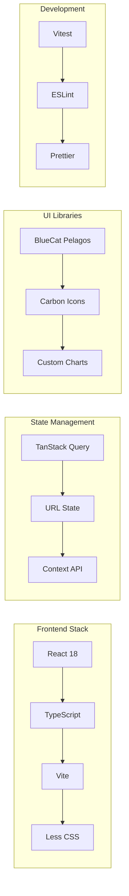
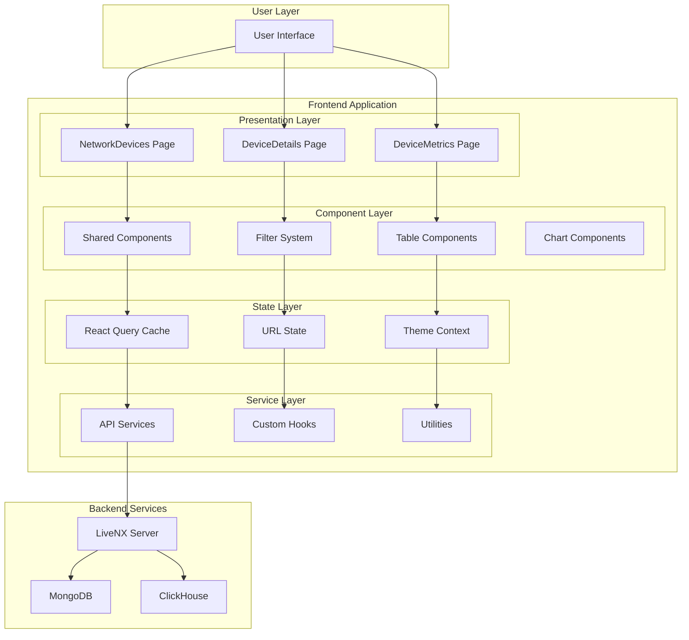
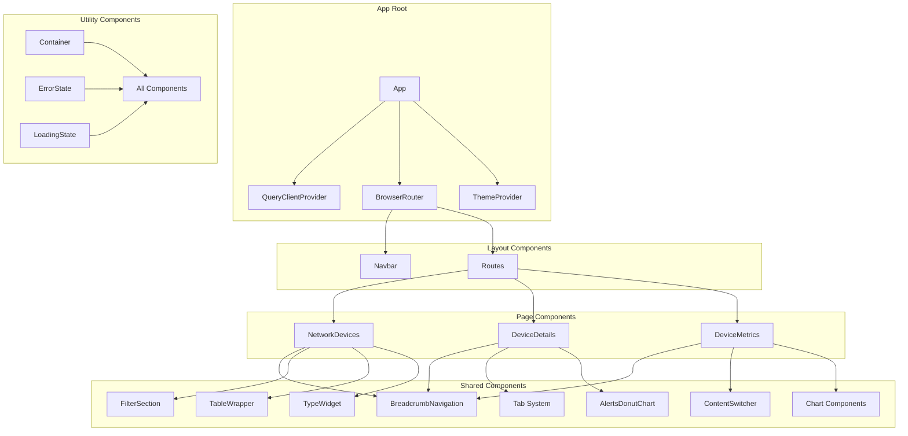
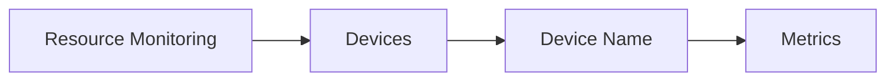
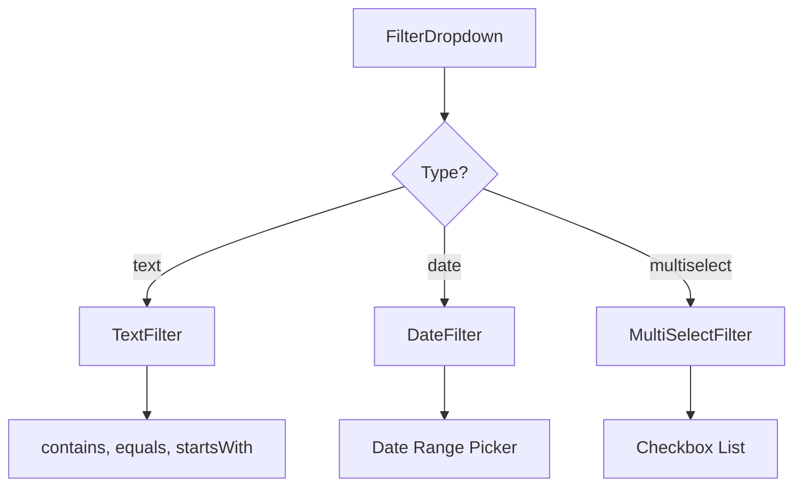
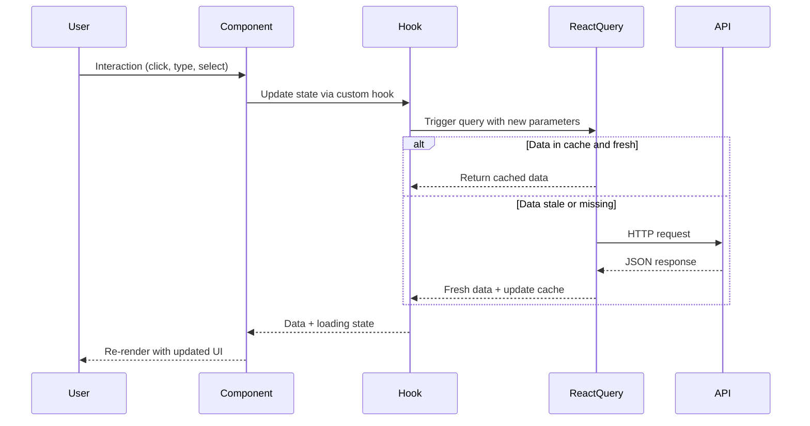
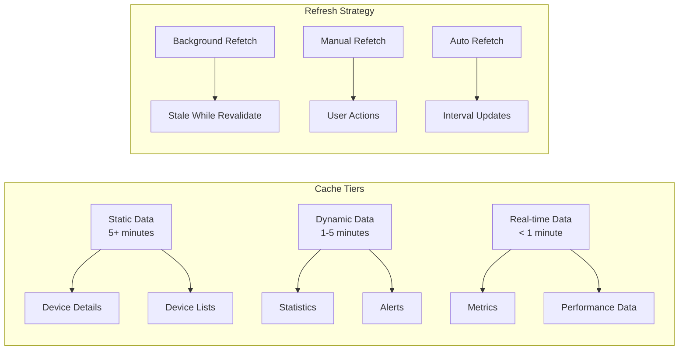
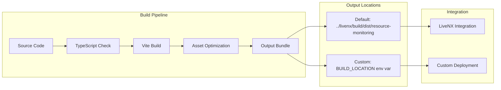

# Resource Monitoring Frontend - Complete Documentation

## 📚 Table of Contents

- [Overview](#overview)
- [Quick Start](#quick-start)
- [Architecture](#architecture)
- [Components](#components)
- [API Integration](#api-integration)
- [Development Guide](#development-guide)
- [Testing](#testing)
- [Deployment](#deployment)
- [Troubleshooting](#troubleshooting)

---

## 🎯 Overview

The Resource Monitoring Frontend is a React-based dashboard application for monitoring network devices in the LiveNX ecosystem. It provides comprehensive device management, real-time metrics visualization, and advanced filtering capabilities.

### Key Features

- **Device Management**: View, search, and filter network devices
- **Real-time Monitoring**: CPU, memory, storage, and network interface metrics
- **Advanced Filtering**: Multi-dimensional filtering with URL persistence
- **Responsive Design**: Optimized for desktop and tablet viewing
- **Theme Support**: Light and dark mode switching
- **Historical Data**: Time-series analysis and comparison tools

### Technology Stack



---

## 🚀 Quick Start

### Prerequisites

- **Node.js 23+** (for development)
- **Node.js 22+** (for livenx-web integration)
- **SSH access** to development/staging environments

### Local Development Setup

1. **Setup SSH Tunnels** (Required for API access):
   ```bash
   # Development environment (replace with appropriate IP)
   ssh -f -N -L 27017:127.0.0.1:27017 admin@10.244.17.62  # MongoDB
   ssh -f -N -L 8093:127.0.0.1:8093 admin@10.244.17.62    # Java Server
   ssh -f -N -L 4041:127.0.0.1:4041 admin@10.244.17.62    # ClickHouse
   ```

2. **Start LiveNX Backend** (Required dependency):
   ```bash
   cd ../livenx-web
   nvm use 22
   npm install
   npm run sandbox
   ```

3. **Start Resource Monitoring Frontend**:
   ```bash
   nvm use 23
   npm install
   npm run dev
   ```

4. **Access the Application**:
   - Frontend: `http://localhost:5173/resource-monitoring`
   - Build output: `../livenx/build/dev/resource-monitoring`

### Environment Configuration

| Environment | SSH Target | Purpose |
|-------------|------------|---------|
| Development | 10.244.17.62 | Main development |
| Staging | 10.244.17.61 | Pre-production testing |
| QA | 10.244.17.63 | Quality assurance |

---

## 🏗️ Architecture

### High-Level Architecture



### Project Structure

```
src/
├── 📁 components/          # Reusable UI components
│   ├── 🗂️ BreadcrumbNavigation/  # Navigation breadcrumbs
│   ├── 🗂️ charts/              # Chart components (Donut, Trend)
│   ├── 🗂️ Container/           # Layout wrapper component
│   ├── 🗂️ ContentSwitcher/     # Tab switching component
│   ├── 🗂️ FilterDropdown/      # Advanced filtering system
│   ├── 🗂️ FilterSection/       # Filter management
│   ├── 🗂️ Navbar/              # Top navigation bar
│   ├── 🗂️ Search/              # Search input components
│   ├── 🗂️ TableWrapper/        # Reusable table with sorting/pagination
│   └── 🗂️ TypeWidget/          # Device type summary widgets
│
├── 📁 context/             # React contexts
│   └── ThemeContext.tsx     # Light/dark theme management
│
├── 📁 helpers/            # Utility functions
│   ├── datetime.ts         # Date/time formatting
│   ├── number.ts          # Number formatting
│   ├── string.ts          # String manipulation
│   └── 📁 metrics/         # Metrics data processing
│
├── 📁 hooks/              # Custom React hooks
│   ├── useClickOutside.ts  # Handle outside clicks
│   ├── useDebouncedValue.ts # Input debouncing
│   └── useUpdateSearchParams.ts # URL state management
│
├── 📁 pages/              # Route-level components
│   ├── 📁 Device/          # Individual device view
│   ├── 📁 DeviceMetrics/   # Device metrics dashboard
│   ├── 📁 NetworkDevices/  # Device list/overview
│   └── customTableMappers.ts # Table cell renderers
│
├── 📁 services/           # External service integration
│   ├── apiClient.ts       # Axios configuration
│   └── 📁 api/            # API endpoint definitions
│
├── 📁 styles/             # Global styles and themes
│   ├── index.less         # Main stylesheet
│   ├── 📁 base/           # Base styles
│   ├── 📁 themes/         # Theme definitions
│   └── 📁 utils/          # Style utilities
│
├── 📁 tests/              # Test utilities
└── 📁 types/              # TypeScript type definitions
```

### Component Hierarchy



---

## 📱 Components

### Core Layout Components

#### Container
**Purpose**: Flexible layout wrapper with consistent spacing and alignment.

```tsx
// Usage Examples
<Container isVertical spacing={{ top: 16, bottom: 16 }}>
  <h1>Page Title</h1>
  <p>Content</p>
</Container>

<Container justify="space-between" align="center">
  <div>Left Content</div>
  <div>Right Content</div>
</Container>
```

**Props**:
- `isVertical?: boolean` - Stack children vertically
- `spacing?: SpacingProps` - Margin/padding configuration
- `justify?: string` - Flexbox justify-content
- `align?: string` - Flexbox align-items

#### BreadcrumbNavigation
**Purpose**: Dynamic breadcrumb navigation based on current route.



**Features**:
- Auto-generates from URL structure
- Maintains pagination state
- Click navigation to parent routes

### Data Display Components

#### TableWrapper
**Purpose**: Reusable table with sorting, pagination, and custom renderers.

```tsx
// Example Usage
<TableWrapper
  data={devices}
  columns={deviceColumns}
  getRowId={row => row.id}
  customRenderers={{
    usage: ProgressBarRenderer,
    status: StatusBadgeRenderer
  }}
/>
```

**Features**:
- **Sorting**: Click column headers to sort
- **Pagination**: Configurable page sizes
- **Custom Renderers**: Component-based cell rendering
- **Loading States**: Built-in skeleton loading
- **Error Handling**: Graceful error display

#### Charts
**Purpose**: Data visualization components for metrics.

**DonutChart**: 
```tsx
<DonutChart 
  data={alertData} 
  colors={customColors}
  centerText="Total Alerts"
/>
```

**TrendChart**:
```tsx
<TrendChart 
  data={timeSeriesData}
  timeRange="24h"
  metrics={['cpu', 'memory']}
/>
```

### Interactive Components

#### FilterDropdown
**Purpose**: Advanced filtering with multiple data types and operations.



**Supported Filter Types**:
- **Text**: String matching with operations (contains, equals, starts with)
- **Date**: Date range selection with presets
- **MultiSelect**: Multiple option selection with search

#### ContentSwitcher
**Purpose**: Tab-like switching between different views.

```tsx
const tabs = [
  { label: 'Basic', value: 'basic' },
  { label: 'Historical', value: 'historical' }
];

<ContentSwitcher 
  tabs={tabs} 
  selectedValue={currentTab}
  onChange={setCurrentTab}
/>
```

### Data Flow Pattern



---

## 🔌 API Integration

### API Client Configuration

```typescript
// src/services/apiClient.ts
const apiClient = axios.create({
  baseURL: '/',
  headers: { 'Content-Type': 'application/json' },
  withCredentials: true,
});

// Auto-redirect on authentication failure
apiClient.interceptors.response.use(
  response => response,
  error => {
    if (error.response?.status === 401) {
      window.location.href = '/login';
    }
    return Promise.reject(error);
  }
);
```

### Query Patterns

#### Device Queries
```typescript
// Devices list with filtering and pagination
export const useDevices = (
  pageSize: number,
  page: number,
  sortBy: string,
  sortDirection: string,
  searchValue: string
) => {
  return useQuery({
    queryKey: ['devices', pageSize, page, sortBy, sortDirection, searchValue],
    queryFn: () => fetchDevices(pageSize, page, sortBy, sortDirection, searchValue),
    staleTime: 5 * 60 * 1000, // 5 minutes
  });
};

// Individual device details
export const useDevice = (id?: string) => {
  return useQuery({
    queryKey: ['device', id],
    queryFn: () => fetchDevice(id!),
    enabled: !!id,
    staleTime: 5 * 60 * 1000,
  });
};
```

#### Metrics Queries
```typescript
// Real-time metrics with shorter cache
export const useMetrics = (filter: string, deviceId?: string) => {
  return useQuery({
    queryKey: ['metrics', filter, deviceId],
    queryFn: () => fetchMetrics(filter),
    staleTime: 1 * 60 * 1000, // 1 minute for real-time data
    refetchInterval: 30 * 1000, // Auto-refresh every 30 seconds
  });
};
```

### Caching Strategy



### Error Handling

```typescript
// Global error handling pattern
const { data, isLoading, error, refetch } = useDevices(/* params */);

if (isLoading) return <LoadingSpinner />;
if (error) return (
  <ErrorState 
    title="Failed to load devices"
    text={error.message}
    onRetry={() => refetch()}
  />
);

return <DevicesTable data={data} />;
```

---

## 👨‍💻 Development Guide

### State Management Patterns

#### URL-Based State
Most application state is stored in URL search parameters for:
- **Persistence**: State survives page refreshes
- **Sharing**: URLs can be shared with exact state
- **History**: Browser back/forward navigation works

```typescript
// Reading URL state
const [searchParams, setSearchParams] = useSearchParams();
const currentPage = parseInt(searchParams.get('page') || '1');

// Updating URL state
const updateFilters = (newFilters: FilterState[]) => {
  const newParams = new URLSearchParams(searchParams);
  // Apply filter changes to URL
  setSearchParams(newParams);
};
```

#### Custom Hook Patterns

```typescript
// Pagination hook example
export function usePagination() {
  const [searchParams, setSearchParams] = useSearchParams();
  
  const page = useMemo(() => 
    parseInt(searchParams.get('page') || '1'), 
    [searchParams]
  );
  
  const setPage = useCallback((newPage: number) => {
    const newParams = new URLSearchParams(searchParams);
    newParams.set('page', newPage.toString());
    setSearchParams(newParams);
  }, [searchParams, setSearchParams]);
  
  return { page, setPage };
}
```

### Component Development Guidelines

#### 1. Component Structure
```typescript
// Component template
interface ComponentProps {
  // Define props with clear types
  data: DataType;
  onAction?: (item: DataType) => void;
  className?: string;
}

const Component: React.FC<ComponentProps> = ({ 
  data, 
  onAction, 
  className 
}) => {
  // Hooks at the top
  const [localState, setLocalState] = useState();
  const { queryData } = useCustomHook();
  
  // Event handlers
  const handleClick = useCallback(() => {
    onAction?.(data);
  }, [data, onAction]);
  
  // Early returns for loading/error states
  if (!data) return <ErrorState />;
  
  // Main render
  return (
    <Container className={className}>
      {/* Component content */}
    </Container>
  );
};
```

#### 2. Styling Conventions
```less
// Component-specific styles in ComponentName/styles.less
.component-name {
  // Use CSS custom properties for theming
  background-color: var(--background-color);
  color: var(--text-color);
  
  // Nested selectors for sub-elements
  &__header {
    font-size: var(--font-size-lg);
    font-weight: var(--font-weight-semibold);
  }
  
  &__content {
    padding: var(--spacing-md);
  }
  
  // Modifiers
  &--loading {
    opacity: 0.6;
    pointer-events: none;
  }
}
```

### Adding New Features

#### 1. Adding a New Page
```typescript
// 1. Create page component in src/pages/NewPage/
const NewPage: React.FC = () => {
  return (
    <Container isVertical>
      <BreadcrumbNavigation />
      <h1>New Page Title</h1>
      {/* Page content */}
    </Container>
  );
};

// 2. Add route in App.tsx
<Route path="new-page" element={<NewPage />} />

// 3. Add navigation links where appropriate
<Link to="/resource-monitoring/new-page">New Page</Link>
```

#### 2. Adding a New Filter Type
```typescript
// 1. Define filter type in FilterDropdown/types.ts
export interface FilterValueMap {
  // ... existing types
  newType: NewTypeValue;
}

// 2. Create filter component
const NewTypeFilter: React.FC<NewTypeFilterProps> = ({ ... }) => {
  // Filter implementation
};

// 3. Register in filterConfig.tsx
export const filterConfig = {
  // ... existing configs
  newType: {
    Component: NewTypeFilter,
    getProps: ({ value, onChange, ...rest }) => ({ value, onChange, ...rest }),
  },
};
```

#### 3. Adding New API Endpoints
```typescript
// 1. Define types in services/api/[module]/types.ts
export interface NewDataType {
  id: string;
  name: string;
  // ... other properties
}

// 2. Create API function in services/api/[module]/api.ts
export const fetchNewData = async (params: FetchParams): Promise<NewDataType[]> => {
  const response = await apiClient.get('/api/new-endpoint', { params });
  return response.data;
};

// 3. Create React Query hook in services/api/[module]/query.ts
export const useNewData = (params: FetchParams) => {
  return useQuery({
    queryKey: ['newData', params],
    queryFn: () => fetchNewData(params),
    staleTime: 5 * 60 * 1000,
  });
};
```

### Performance Optimization

#### 1. Memoization Patterns
```typescript
// Expensive calculations
const expensiveValue = useMemo(() => {
  return data?.map(item => processItem(item));
}, [data]);

// Event handlers
const handleClick = useCallback((item: ItemType) => {
  onItemClick(item);
}, [onItemClick]);

// Component memoization
const OptimizedComponent = React.memo(({ data, onAction }) => {
  // Component implementation
});
```

#### 2. Query Optimization
```typescript
// Prefetching related data
const queryClient = useQueryClient();

const prefetchRelatedData = useCallback((id: string) => {
  queryClient.prefetchQuery({
    queryKey: ['relatedData', id],
    queryFn: () => fetchRelatedData(id),
  });
}, [queryClient]);

// Optimistic updates
const mutation = useMutation({
  mutationFn: updateData,
  onMutate: async (newData) => {
    await queryClient.cancelQueries({ queryKey: ['data'] });
    const previousData = queryClient.getQueryData(['data']);
    queryClient.setQueryData(['data'], newData);
    return { previousData };
  },
  onError: (err, newData, context) => {
    queryClient.setQueryData(['data'], context.previousData);
  },
});
```

---

## 🧪 Testing

### Testing Strategy

```mermaid
graph TD
    subgraph "Testing Pyramid"
        A[Unit Tests<br/>Components & Utils] --> B[Integration Tests<br/>Pages & Workflows]
        B --> C[E2E Tests<br/>User Journeys]
    end
    
    subgraph "Testing Tools"
        D[Vitest<br/>Test Runner] --> E[Testing Library<br/>Component Testing]
        E --> F[MSW<br/>API Mocking]
        F --> G[User Events<br/>Interaction Testing]
    end
    
    subgraph "Coverage Areas"
        H[Component Rendering] --> I[User Interactions]
        I --> J[API Integration]
        J --> K[State Management]
        K --> L[Error Scenarios]
    end
```



### Testing Utilities

```typescript
// src/tests/renderWithProviders.tsx
export const renderWithProviders = (
  component: React.ReactElement,
  options: RenderOptions = {}
) => {
  const queryClient = new QueryClient({
    defaultOptions: {
      queries: { retry: false },
      mutations: { retry: false },
    },
  });

  const AllProviders = ({ children }: { children: React.ReactNode }) => (
    <QueryClientProvider client={queryClient}>
      <BrowserRouter>
        <ThemeProvider>
          {children}
        </ThemeProvider>
      </BrowserRouter>
    </QueryClientProvider>
  );

  return render(component, { wrapper: AllProviders, ...options });
};
```

### Component Testing Examples

#### 1. Basic Component Test
```typescript
import { renderWithProviders } from '@tests/renderWithProviders';
import { screen, waitFor } from '@testing-library/react';
import userEvent from '@testing-library/user-event';

describe('DevicesTable', () => {
  it('renders device data correctly', async () => {
    renderWithProviders(<DevicesTable searchValue="" />);
    
    await waitFor(() => {
      expect(screen.getByText('Device Name')).toBeInTheDocument();
    });
  });

  it('handles sorting when column header is clicked', async () => {
    const user = userEvent.setup();
    renderWithProviders(<DevicesTable searchValue="" />);
    
    const hostNameHeader = screen.getByText('Device');
    await user.click(hostNameHeader);
    
    await waitFor(() => {
      expect(screen.getByTestId('sort-indicator')).toHaveClass('sort-asc');
    });
  });
});
```

#### 2. API Integration Test
```typescript
import { server } from '@tests/mocks/server';
import { http, HttpResponse } from 'msw';

describe('useDevices hook', () => {
  it('fetches devices successfully', async () => {
    server.use(
      http.get('/api/devices', () => {
        return HttpResponse.json({
          items: [{ id: '1', hostName: 'test-device' }],
          totalCount: 1,
        });
      })
    );

    const { result } = renderHook(() => useDevices(10, 1, 'hostName', 'asc', ''), {
      wrapper: createQueryWrapper(),
    });

    await waitFor(() => {
      expect(result.current.isSuccess).toBe(true);
    });
    
    expect(result.current.data?.items).toHaveLength(1);
  });
});
```

### Running Tests

```bash
# Run all tests
npm test

# Run tests in watch mode
npm run test:watch

# Run tests with coverage
npm run test:coverage

# Run specific test file
npm test -- DevicesTable.test.tsx

# Run tests matching pattern
npm test -- --grep="filter"
```

---

## 🚀 Deployment

### Build Process



### Build Commands

```bash
# Development build with file watching
npm run dev

# Production build
npm run build

# Custom build location
BUILD_LOCATION=/custom/path npm run build

# Build and preview
npm run build && npm run preview
```

### Environment Configuration

#### Development Environment
```bash
# Required before starting development
ssh -f -N -L 27017:127.0.0.1:27017 admin@10.244.17.62
ssh -f -N -L 8093:127.0.0.1:8093 admin@10.244.17.62
ssh -f -N -L 4041:127.0.0.1:4041 admin@10.244.17.62

# Start livenx-web (dependency)
cd ../livenx-web && npm run sandbox

# Start resource monitoring
npm run dev
```

#### Production Deployment
1. **Build the application**: `npm run build`
2. **Copy build artifacts** to LiveNX deployment directory
3. **Configure nginx/apache** to serve static files
4. **Update LiveNX configuration** to include resource monitoring routes

### Docker Configuration (Future Enhancement)
```dockerfile
# Multi-stage build for production
FROM node:23-alpine AS builder
WORKDIR /app
COPY package*.json ./
RUN npm ci --only=production

COPY . .
RUN npm run build

FROM nginx:alpine
COPY --from=builder /app/dist /usr/share/nginx/html
COPY nginx.conf /etc/nginx/conf.d/default.conf
EXPOSE 80
CMD ["nginx", "-g", "daemon off;"]
```

---

## 🔧 Troubleshooting

### Common Issues

#### 1. API Connection Issues
**Symptoms**: 
- "Failed to load devices" errors
- Network timeouts
- 401 authentication errors

**Solutions**:
```bash
# Check SSH tunnels are running
ps aux | grep ssh

# Restart tunnels if needed
ssh -f -N -L 27017:127.0.0.1:27017 admin@10.244.17.62

# Verify LiveNX sandbox is running
cd ../livenx-web && npm run sandbox

# Clear browser cache and cookies
```

#### 2. Build Issues
**Symptoms**:
- TypeScript compilation errors
- Missing dependencies
- Vite build failures

**Solutions**:
```bash
# Clear node_modules and reinstall
rm -rf node_modules package-lock.json
npm install

# Clear Vite cache
npx vite --clearCache

# Check Node.js version
node --version  # Should be 23+
```

#### 3. Performance Issues
**Symptoms**:
- Slow page loads
- Unresponsive UI
- Memory leaks

**Debugging**:
```typescript
// Enable React Query devtools in development
import { ReactQueryDevtools } from '@tanstack/react-query-devtools';

function App() {
  return (
    <>
      {/* Your app */}
      <ReactQueryDevtools initialIsOpen={false} />
    </>
  );
}
```

#### 4. State Management Issues
**Symptoms**:
- Filters not persisting
- URL state not updating
- Component state out of sync

**Debugging**:
```typescript
// Debug URL state changes
useEffect(() => {
  console.log('Search params changed:', searchParams.toString());
}, [searchParams]);

// Debug React Query cache
const queryClient = useQueryClient();
console.log('Cache data:', queryClient.getQueryData(['devices']));
```

### Development Workflow Issues

#### Node Version Management
```bash
# Install and use correct Node versions
nvm install 22
nvm install 23

# For livenx-web
nvm use 22

# For resource monitoring
nvm use 23
```

#### SSH Tunnel Management
```bash
# Kill existing tunnels
pkill -f "ssh.*27017"
pkill -f "ssh.*8093" 
pkill -f "ssh.*4041"

# Create tunnel management script
#!/bin/bash
ssh -f -N -L 27017:127.0.0.1:27017 admin@$1
ssh -f -N -L 8093:127.0.0.1:8093 admin@$1
ssh -f -N -L 4041:127.0.0.1:4041 admin@$1
echo "Tunnels created for $1"
```

### Debug Tools

#### Browser DevTools Extensions
- **React Developer Tools**: Component inspection
- **TanStack Query DevTools**: Query cache debugging
- **Redux DevTools**: State management (if using Redux)

#### VS Code Extensions
- **ES7+ React/Redux/React-Native snippets**
- **TypeScript Importer**
- **Auto Rename Tag**
- **Bracket Pair Colorizer**
- **GitLens**

#### Command Line Tools
```bash
# Analyze bundle size
npm run build && npx bundle-analyzer dist

# Check for outdated dependencies
npm outdated

# Audit security issues
npm audit

# Check TypeScript issues
npx tsc --noEmit
```

---

## 📋 Best Practices Checklist

### Code Quality
- [ ] Components have clear, descriptive names
- [ ] TypeScript interfaces are properly defined
- [ ] Props are documented with JSDoc comments
- [ ] Error boundaries are implemented for error handling
- [ ] Loading states are shown during async operations

### Performance
- [ ] Components are memoized where appropriate
- [ ] Event handlers use useCallback
- [ ] Expensive calculations use useMemo
- [ ] Images are optimized and lazy-loaded
- [ ] Bundle size is monitored and optimized

### Accessibility
- [ ] Semantic HTML elements are used
- [ ] ARIA labels are provided for interactive elements
- [ ] Keyboard navigation works correctly
- [ ] Color contrast meets WCAG guidelines
- [ ] Screen reader compatibility is tested

### Testing
- [ ] Components have unit tests
- [ ] User interactions are tested
- [ ] API integrations are mocked and tested
- [ ] Error scenarios are covered
- [ ] Test coverage is maintained above 80%

### Documentation
- [ ] README is up to date
- [ ] Component APIs are documented
- [ ] Complex business logic has comments
- [ ] Architecture decisions are recorded
- [ ] Troubleshooting guides are maintained

---

## 🚀 Future Enhancements

### Planned Features
- **Real-time WebSocket Integration**: Live metric updates
- **Advanced Analytics**: Machine learning insights
- **Mobile Responsiveness**: Touch-optimized interface
- **Internationalization**: Multi-language support
- **Accessibility Improvements**: WCAG 2.1 AA compliance

### Technical Improvements
- **Micro-frontend Architecture**: Modular deployment
- **Service Worker**: Offline capability
- **Progressive Web App**: App-like experience
- **GraphQL Integration**: More efficient data fetching
- **Component Library**: Shared design system

---

This documentation provides a comprehensive guide to understanding, developing, and maintaining the Resource Monitoring Frontend application. For specific questions or issues not covered here, please refer to the team's internal knowledge base or reach out to the development team.