# Testing Documentation

## 🧪 Overview

This document covers the comprehensive testing strategy for the Resource Monitoring Frontend, including unit tests, integration tests, accessibility testing, and performance testing.

## 🏗️ Testing Architecture

### Testing Pyramid

```mermaid
graph TB
    subgraph "Testing Pyramid"
        A[End-to-End Tests<br/>5% - User Journeys] --> B[Integration Tests<br/>25% - Component Integration]
        B --> C[Unit Tests<br/>70% - Individual Components]
    end
    
    subgraph "Test Types"
        D[Component Tests] --> E[Hook Tests]
        E --> F[Service Tests]
        F --> G[Utility Tests]
        G --> H[Accessibility Tests]
        H --> I[Visual Tests]
    end
    
    subgraph "Testing Tools"
        J[Vitest<br/>Test Runner] --> K[Testing Library<br/>DOM Testing]
        K --> L[MSW<br/>API Mocking]
        L --> M[Axe<br/>Accessibility]
        M --> N[User Events<br/>Interaction Testing]
    end
```



### Testing Stack

```typescript
// Core testing dependencies
{
  "vitest": "^3.2.4",                    // Test runner
  "@testing-library/react": "^16.3.0",   // React testing utilities
  "@testing-library/jest-dom": "^6.6.3", // Custom matchers
  "@testing-library/user-event": "^14.6.1", // User interaction
  "msw": "^2.0.0",                       // API mocking
  "@axe-core/react": "^4.8.0",          // Accessibility testing
  "jsdom": "^26.1.0"                     // DOM environment
}
```

---

## ⚙️ Test Configuration

### Vitest Configuration

```typescript
// vitest.config.ts
import { defineConfig } from 'vitest/config';
import react from '@vitejs/plugin-react-swc';
import path from 'path';

export default defineConfig({
  plugins: [react()],
  test: {
    globals: true,
    environment: 'jsdom',
    setupFiles: ['./src/tests/setupTests.ts'],
    css: true,
    coverage: {
      provider: 'v8',
      reporter: ['text', 'json', 'html'],
      exclude: [
        'node_modules/',
        'src/tests/',
        '**/*.d.ts',
        '**/*.config.*',
        '**/index.ts',
      ],
      thresholds: {
        global: {
          branches: 80,
          functions: 80,
          lines: 80,
          statements: 80,
        },
        // Specific thresholds for critical files
        'src/services/': {
          branches: 90,
          functions: 90,
          lines: 90,
          statements: 90,
        },
      },
    },
    // Test timeout
    testTimeout: 10000,
    hookTimeout: 10000,
    
    // Retry flaky tests
    retry: 2,
    
    // Reporter configuration
    reporter: ['verbose', 'junit'],
    outputFile: {
      junit: './test-results/junit.xml',
    },
    
    // Watch mode configuration
    watch: {
      exclude: ['node_modules/**', 'dist/**'],
    },
  },
  resolve: {
    alias: {
      '@': path.resolve(__dirname, './src'),
      '@components': path.resolve(__dirname, './src/components'),
      '@pages': path.resolve(__dirname, './src/pages'),
      '@services': path.resolve(__dirname, './src/services'),
      '@hooks': path.resolve(__dirname, './src/hooks'),
      '@helpers': path.resolve(__dirname, './src/helpers'),
      '@context': path.resolve(__dirname, './src/context'),
      '@tests': path.resolve(__dirname, './src/tests'),
    },
  },
});
```

### Test Setup

```typescript
// src/tests/setupTests.ts
import '@testing-library/jest-dom';
import { cleanup } from '@testing-library/react';
import { afterEach, beforeAll, afterAll } from 'vitest';
import { server } from './mocks/server';

// Mock Service Worker setup
beforeAll(() => {
  server.listen({ onUnhandledRequest: 'error' });
});

afterEach(() => {
  server.resetHandlers();
  cleanup();
});

afterAll(() => {
  server.close();
});

// Mock IntersectionObserver
global.IntersectionObserver = class IntersectionObserver {
  constructor() {}
  observe() {}
  disconnect() {}
  unobserve() {}
};

// Mock ResizeObserver
global.ResizeObserver = class ResizeObserver {
  constructor(cb: any) {}
  observe() {}
  disconnect() {}
  unobserve() {}
};

// Mock window.matchMedia
Object.defineProperty(window, 'matchMedia', {
  writable: true,
  value: (query: string) => ({
    matches: false,
    media: query,
    onchange: null,
    addListener: () => {},
    removeListener: () => {},
    addEventListener: () => {},
    removeEventListener: () => {},
    dispatchEvent: () => {},
  }),
});

// Mock localStorage
const localStorageMock = (() => {
  let store: Record<string, string> = {};
  return {
    getItem: (key: string) => store[key] || null,
    setItem: (key: string, value: string) => {
      store[key] = value.toString();
    },
    removeItem: (key: string) => {
      delete store[key];
    },
    clear: () => {
      store = {};
    },
  };
})();

Object.defineProperty(window, 'localStorage', {
  value: localStorageMock,
});

// Suppress console errors in tests unless explicitly testing error handling
const originalError = console.error;
console.error = (...args: any[]) => {
  if (
    typeof args[0] === 'string' &&
    args[0].includes('Warning: ReactDOM.render is no longer supported')
  ) {
    return;
  }
  originalError.call(console, ...args);
};
```

---

## 🧪 Unit Testing

### Component Testing Patterns

#### Basic Component Test

```typescript
// src/components/Container/__tests__/Container.test.tsx
import { render, screen } from '@testing-library/react';
import Container from '../Container';

describe('Container', () => {
  it('renders children correctly', () => {
    render(
      <Container>
        <div>Test Content</div>
      </Container>
    );
    
    expect(screen.getByText('Test Content')).toBeInTheDocument();
  });
  
  it('applies vertical layout when isVertical prop is true', () => {
    render(
      <Container isVertical data-testid="container">
        <div>Content</div>
      </Container>
    );
    
    const container = screen.getByTestId('container');
    expect(container).toHaveStyle({ flexDirection: 'column' });
  });
  
  it('applies spacing correctly', () => {
    render(
      <Container 
        spacing={{ top: 16, left: 8 }}
        data-testid="container"
      >
        <div>Content</div>
      </Container>
    );
    
    const container = screen.getByTestId('container');
    expect(container).toHaveStyle({
      paddingTop: '16px',
      paddingLeft: '8px',
    });
  });
  
  it('forwards className prop', () => {
    render(
      <Container className="custom-class" data-testid="container">
        <div>Content</div>
      </Container>
    );
    
    expect(screen.getByTestId('container')).toHaveClass('custom-class');
  });
});
```

#### Interactive Component Test

```typescript
// src/components/FilterDropdown/__tests__/FilterDropdown.test.tsx
import { screen, fireEvent, waitFor } from '@testing-library/react';
import userEvent from '@testing-library/user-event';
import { renderWithProviders } from '@tests/renderWithProviders';

import FilterDropdown from '../FilterDropdown';

describe('FilterDropdown', () => {
  it('opens dropdown when trigger is clicked', async () => {
    const user = userEvent.setup();
    
    renderWithProviders(
      <FilterDropdown
        type="text"
        urlKey="test"
        defaultValue={[]}
        extraProps={{
          filterKey: 'test',
          operation: 'contains',
        }}
      />
    );
    
    const trigger = screen.getByRole('button');
    await user.click(trigger);
    
    expect(screen.getByRole('dialog')).toBeInTheDocument();
  });
  
  it('applies filter when Apply button is clicked', async () => {
    const user = userEvent.setup();
    
    renderWithProviders(
      <FilterDropdown
        type="text"
        urlKey="hostname"
        defaultValue={[]}
        extraProps={{
          filterKey: 'hostname',
          operation: 'contains',
        }}
      />
    );
    
    // Open dropdown
    await user.click(screen.getByRole('button'));
    
    // Type in filter value
    const input = screen.getByRole('textbox');
    await user.type(input, 'router');
    
    // Apply filter
    await user.click(screen.getByText('Apply'));
    
    // Verify URL was updated
    expect(window.location.search).toContain('hostname.contains=router');
  });
  
  it('closes dropdown when clicking outside', async () => {
    const user = userEvent.setup();
    
    renderWithProviders(
      <div>
        <FilterDropdown
          type="text"
          urlKey="test"
          defaultValue={[]}
          extraProps={{ filterKey: 'test', operation: 'contains' }}
        />
        <div data-testid="outside">Outside element</div>
      </div>
    );
    
    // Open dropdown
    await user.click(screen.getByRole('button'));
    expect(screen.getByRole('dialog')).toBeInTheDocument();
    
    // Click outside
    await user.click(screen.getByTestId('outside'));
    
    await waitFor(() => {
      expect(screen.queryByRole('dialog')).not.toBeInTheDocument();
    });
  });
});
```

#### Component with API Integration

```typescript
// src/components/TableWrapper/__tests__/TableWrapper.test.tsx
import { screen, waitFor, within } from '@testing-library/react';
import userEvent from '@testing-library/user-event';
import { renderWithProviders } from '@tests/renderWithProviders';
import { server } from '@tests/mocks/server';
import { http, HttpResponse } from 'msw';

import TableWrapper from '../TableWrapper';
import type { Column } from '../types';

const mockData = [
  { id: '1', name: 'Item 1', status: 'active' },
  { id: '2', name: 'Item 2', status: 'inactive' },
];

const columns: Column<typeof mockData[0]>[] = [
  { key: 'name', label: 'Name', sortable: true },
  { key: 'status', label: 'Status' },
];

describe('TableWrapper', () => {
  it('renders table with data', () => {
    renderWithProviders(
      <TableWrapper
        data={mockData}
        columns={columns}
        getRowId={(row) => row.id}
      />
    );
    
    expect(screen.getByRole('table')).toBeInTheDocument();
    expect(screen.getByText('Item 1')).toBeInTheDocument();
    expect(screen.getByText('Item 2')).toBeInTheDocument();
  });
  
  it('handles sorting when column header is clicked', async () => {
    const user = userEvent.setup();
    
    renderWithProviders(
      <TableWrapper
        data={mockData}
        columns={columns}
        getRowId={(row) => row.id}
      />
    );
    
    const nameHeader = screen.getByText('Name');
    await user.click(nameHeader);
    
    // Verify sort indicator appears
    expect(screen.getByTestId('sort-asc')).toBeInTheDocument();
    
    // Click again for descending sort
    await user.click(nameHeader);
    expect(screen.getByTestId('sort-desc')).toBeInTheDocument();
  });
  
  it('shows loading state', () => {
    renderWithProviders(
      <TableWrapper
        data={[]}
        columns={columns}
        getRowId={(row) => row.id}
        isLoading={true}
      />
    );
    
    expect(screen.getByTestId('table-skeleton')).toBeInTheDocument();
  });
  
  it('shows error state with retry option', async () => {
    const onRetry = vi.fn();
    const user = userEvent.setup();
    const error = new Error('Failed to load data');
    
    renderWithProviders(
      <TableWrapper
        data={[]}
        columns={columns}
        getRowId={(row) => row.id}
        error={error}
        onRetry={onRetry}
      />
    );
    
    expect(screen.getByText('Failed to load data')).toBeInTheDocument();
    
    const retryButton = screen.getByText('Retry');
    await user.click(retryButton);
    
    expect(onRetry).toHaveBeenCalledTimes(1);
  });
  
  it('handles row selection', async () => {
    const onRowClick = vi.fn();
    const user = userEvent.setup();
    
    renderWithProviders(
      <TableWrapper
        data={mockData}
        columns={columns}
        getRowId={(row) => row.id}
        onRowClick={onRowClick}
      />
    );
    
    const firstRow = screen.getByText('Item 1').closest('tr');
    await user.click(firstRow!);
    
    expect(onRowClick).toHaveBeenCalledWith(mockData[0]);
  });
  
  it('renders custom cell renderers', () => {
    const customRenderers = {
      status: ({ value }: { value: string }) => (
        <span className={`status-${value}`}>{value.toUpperCase()}</span>
      ),
    };
    
    renderWithProviders(
      <TableWrapper
        data={mockData}
        columns={columns}
        getRowId={(row) => row.id}
        customRenderers={customRenderers}
      />
    );
    
    expect(screen.getByText('ACTIVE')).toBeInTheDocument();
    expect(screen.getByText('INACTIVE')).toBeInTheDocument();
    expect(screen.getByText('ACTIVE')).toHaveClass('status-active');
  });
});
```

### Custom Hook Testing

```typescript
// src/hooks/__tests__/usePagination.test.ts
import { renderHook, act } from '@testing-library/react';
import { BrowserRouter } from 'react-router-dom';
import { usePagination } from '../usePagination';

const wrapper = ({ children }: { children: React.ReactNode }) => (
  <BrowserRouter>{children}</BrowserRouter>
);

describe('usePagination', () => {
  beforeEach(() => {
    // Reset URL before each test
    window.history.replaceState({}, '', '/');
  });
  
  it('initializes with default values', () => {
    const { result } = renderHook(() => usePagination(), { wrapper });
    
    expect(result.current.page).toBe(1);
    expect(result.current.pageSize).toBe(50);
  });
  
  it('reads initial values from URL parameters', () => {
    window.history.replaceState({}, '', '/?page=3&pageSize=25');
    
    const { result } = renderHook(() => usePagination(), { wrapper });
    
    expect(result.current.page).toBe(3);
    expect(result.current.pageSize).toBe(25);
  });
  
  it('updates URL when page changes', () => {
    const { result } = renderHook(() => usePagination(), { wrapper });
    
    act(() => {
      result.current.setPage(5);
    });
    
    expect(window.location.search).toContain('page=5');
    expect(result.current.page).toBe(5);
  });
  
  it('updates URL when page size changes', () => {
    const { result } = renderHook(() => usePagination(), { wrapper });
    
    act(() => {
      result.current.setPageSize(100);
    });
    
    expect(window.location.search).toContain('pageSize=100');
    expect(result.current.pageSize).toBe(100);
  });
  
  it('preserves other URL parameters', () => {
    window.history.replaceState({}, '', '/?search=test&sort=name');
    
    const { result } = renderHook(() => usePagination(), { wrapper });
    
    act(() => {
      result.current.setPage(2);
    });
    
    const searchParams = new URLSearchParams(window.location.search);
    expect(searchParams.get('page')).toBe('2');
    expect(searchParams.get('search')).toBe('test');
    expect(searchParams.get('sort')).toBe('name');
  });
});
```

### Service/API Testing

```typescript
// src/services/api/devices/__tests__/api.test.ts
import { server } from '@tests/mocks/server';
import { http, HttpResponse } from 'msw';
import { fetchDevices, fetchDevice } from '../api';

describe('devices API', () => {
  describe('fetchDevices', () => {
    it('fetches devices successfully', async () => {
      const mockResponse = {
        items: [
          { id: '1', hostName: 'router-01', address: '192.168.1.1' },
          { id: '2', hostName: 'switch-01', address: '192.168.1.2' },
        ],
        totalCount: 2,
      };
      
      server.use(
        http.get('/api/devices', () => {
          return HttpResponse.json(mockResponse);
        })
      );
      
      const result = await fetchDevices(10, 1, 'hostName', 'asc', '');
      
      expect(result.items).toHaveLength(2);
      expect(result.items[0].hostName).toBe('router-01');
      expect(result.totalCount).toBe(2);
    });
    
    it('handles API errors', async () => {
      server.use(
        http.get('/api/devices', () => {
          return new HttpResponse(null, { status: 500 });
        })
      );
      
      await expect(fetchDevices(10, 1, 'hostName', 'asc', '')).rejects.toThrow();
    });
    
    it('sends correct query parameters', async () => {
      let capturedRequest: Request | null = null;
      
      server.use(
        http.get('/api/devices', ({ request }) => {
          capturedRequest = request;
          return HttpResponse.json({ items: [], totalCount: 0 });
        })
      );
      
      await fetchDevices(25, 2, 'address', 'desc', 'router');
      
      expect(capturedRequest).toBeTruthy();
      const url = new URL(capturedRequest!.url);
      expect(url.searchParams.get('pageSize')).toBe('25');
      expect(url.searchParams.get('page')).toBe('2');
      expect(url.searchParams.get('sort')).toBe('address');
      expect(url.searchParams.get('direction')).toBe('desc');
      expect(url.searchParams.get('search')).toBe('router');
    });
    
    it('handles network timeouts', async () => {
      server.use(
        http.get('/api/devices', async () => {
          await new Promise(resolve => setTimeout(resolve, 35000));
          return HttpResponse.json({ items: [] });
        })
      );
      
      await expect(fetchDevices(10, 1, 'hostName', 'asc', '')).rejects.toThrow(/timeout/i);
    });
  });
  
  describe('fetchDevice', () => {
    it('fetches individual device', async () => {
      const mockDevice = {
        id: '1',
        hostName: 'router-01',
        address: '192.168.1.1',
        type: 'router',
      };
      
      server.use(
        http.get('/api/devices/1', () => {
          return HttpResponse.json(mockDevice);
        })
      );
      
      const result = await fetchDevice('1');
      
      expect(result.id).toBe('1');
      expect(result.hostName).toBe('router-01');
    });
    
    it('handles 404 errors', async () => {
      server.use(
        http.get('/api/devices/nonexistent', () => {
          return new HttpResponse(null, { status: 404 });
        })
      );
      
      await expect(fetchDevice('nonexistent')).rejects.toThrow();
    });
    
    it('throws error for missing device ID', async () => {
      await expect(fetchDevice('')).rejects.toThrow('Device ID is required');
    });
  });
});
```

---

## 🔗 Integration Testing

### Page Integration Tests

```typescript
// src/pages/NetworkDevices/__tests__/NetworkDevices.integration.test.tsx
import { screen, waitFor, within } from '@testing-library/react';
import userEvent from '@testing-library/user-event';
import { renderWithProviders } from '@tests/renderWithProviders';
import { server } from '@tests/mocks/server';
import { http, HttpResponse } from 'msw';

import NetworkDevices from '../NetworkDevices';

const mockDevices = [
  {
    id: '1',
    hostName: 'router-01',
    address: '192.168.1.1',
    site: 'NYC',
    type: 'router',
    vendorName: 'Cisco',
    status: 'online',
  },
  {
    id: '2',
    hostName: 'switch-01',
    address: '192.168.1.2',
    site: 'NYC',
    type: 'switch',
    vendorName: 'Juniper',
    status: 'offline',
  },
];

const mockStats = {
  items: [
    { name: 'router', count: 1, alerts: [] },
    { name: 'switch', count: 1, alerts: [] },
  ],
};

describe('NetworkDevices Integration', () => {
  beforeEach(() => {
    server.use(
      http.get('/api/devices', () => {
        return HttpResponse.json({
          items: mockDevices,
          totalCount: mockDevices.length,
        });
      }),
      http.get('/api/devices/stats', () => {
        return HttpResponse.json(mockStats);
      })
    );
  });
  
  it('loads and displays devices and statistics', async () => {
    renderWithProviders(<NetworkDevices />);
    
    // Wait for data to load
    await waitFor(() => {
      expect(screen.getByText('router-01')).toBeInTheDocument();
    });
    
    // Verify devices table
    expect(screen.getByText('switch-01')).toBeInTheDocument();
    
    // Verify statistics widgets
    expect(screen.getByText('1', { selector: '.type-widget' })).toBeInTheDocument();
  });
  
  it('filters devices by search term', async () => {
    const user = userEvent.setup();
    renderWithProviders(<NetworkDevices />);
    
    // Wait for initial load
    await waitFor(() => {
      expect(screen.getByText('router-01')).toBeInTheDocument();
    });
    
    // Mock filtered API response
    server.use(
      http.get('/api/devices', ({ request }) => {
        const url = new URL(request.url);
        const search = url.searchParams.get('search');
        
        const filteredDevices = mockDevices.filter(device =>
          device.hostName.includes(search || '')
        );
        
        return HttpResponse.json({
          items: filteredDevices,
          totalCount: filteredDevices.length,
        });
      })
    );
    
    // Search for router
    const searchInput = screen.getByPlaceholderText(/search/i);
    await user.type(searchInput, 'router');
    
    // Wait for debounced search
    await waitFor(() => {
      expect(screen.getByText('router-01')).toBeInTheDocument();
      expect(screen.queryByText('switch-01')).not.toBeInTheDocument();
    });
  });
  
  it('applies and removes filters', async () => {
    const user = userEvent.setup();
    renderWithProviders(<NetworkDevices />);
    
    await waitFor(() => {
      expect(screen.getByText('router-01')).toBeInTheDocument();
    });
    
    // Open add filter dropdown
    const addFilterButton = screen.getByText('Add Filter');
    await user.click(addFilterButton);
    
    // Select vendor filter
    await user.click(screen.getByText('Vendor'));
    
    // Set filter value
    const filterInput = screen.getByRole('textbox');
    await user.type(filterInput, 'Cisco');
    
    // Apply filter
    await user.click(screen.getByText('Apply'));
    
    // Verify filter is applied
    expect(window.location.search).toContain('vendor.contains=Cisco');
    
    // Remove filter
    const filterTag = screen.getByText('Vendor: Cisco');
    const removeButton = within(filterTag.closest('.filter-tag')!).getByRole('button');
    await user.click(removeButton);
    
    // Verify filter is removed
    expect(window.location.search).not.toContain('vendor');
  });
  
  it('handles pagination', async () => {
    const user = userEvent.setup();
    
    // Mock paginated response
    server.use(
      http.get('/api/devices', ({ request }) => {
        const url = new URL(request.url);
        const page = parseInt(url.searchParams.get('page') || '1');
        
        return HttpResponse.json({
          items: page === 1 ? mockDevices : [],
          totalCount: 100, // More than one page
        });
      })
    );
    
    renderWithProviders(<NetworkDevices />);
    
    await waitFor(() => {
      expect(screen.getByText('router-01')).toBeInTheDocument();
    });
    
    // Go to next page
    const nextButton = screen.getByLabelText('Next page');
    await user.click(nextButton);
    
    // Verify URL updated
    expect(window.location.search).toContain('page=2');
  });
  
  it('navigates to device details when row is clicked', async () => {
    const user = userEvent.setup();
    const mockNavigate = vi.fn();
    
    vi.mock('react-router-dom', async () => {
      const actual = await vi.importActual('react-router-dom');
      return {
        ...actual,
        useNavigate: () => mockNavigate,
      };
    });
    
    renderWithProviders(<NetworkDevices />);
    
    await waitFor(() => {
      expect(screen.getByText('router-01')).toBeInTheDocument();
    });
    
    // Click on device row
    const deviceRow = screen.getByText('router-01').closest('tr');
    await user.click(deviceRow!);
    
    expect(mockNavigate).toHaveBeenCalledWith('/resource-monitoring/devices/1');
  });
});
```

### Full User Journey Tests

```typescript
// src/__tests__/userJourneys.test.tsx
import { screen, waitFor } from '@testing-library/react';
import userEvent from '@testing-library/user-event';
import { renderWithProviders } from '@tests/renderWithProviders';
import { server } from '@tests/mocks/server';
import { http, HttpResponse } from 'msw';

import App from '../App';

describe('User Journeys', () => {
  it('completes device monitoring workflow', async () => {
    const user = userEvent.setup();
    
    // Mock all necessary API endpoints
    server.use(
      http.get('/api/devices', () => {
        return HttpResponse.json({
          items: [
            {
              id: '1',
              hostName: 'router-01',
              address: '192.168.1.1',
              status: 'online',
            },
          ],
          totalCount: 1,
        });
      }),
      http.get('/api/devices/1', () => {
        return HttpResponse.json({
          id: '1',
          hostName: 'router-01',
          address: '192.168.1.1',
          status: 'online',
          type: 'router',
        });
      }),
      http.get('/api/devices/1/alerts', () => {
        return HttpResponse.json({
          items: [],
          summary: { critical: 0, warning: 0, info: 0 },
        });
      }),
      http.get('/api/metrics', () => {
        return HttpResponse.json({
          deviceId: '1',
          metrics: {
            cpu: [{ timestamp: '2023-01-01T00:00:00Z', value: 45 }],
            memory: [{ timestamp: '2023-01-01T00:00:00Z', value: 60 }],
          },
        });
      })
    );
    
    // Start at the root
    renderWithProviders(<App />);
    
    // Should redirect to devices page
    await waitFor(() => {
      expect(screen.getByText('Network Devices')).toBeInTheDocument();
    });
    
    // Verify device appears in list
    expect(screen.getByText('router-01')).toBeInTheDocument();
    
    // Click on device to view details
    await user.click(screen.getByText('router-01'));
    
    // Should navigate to device details
    await waitFor(() => {
      expect(screen.getByText('router-01')).toBeInTheDocument();
      expect(screen.getByText('Device Details')).toBeInTheDocument();
    });
    
    // Navigate to metrics
    await user.click(screen.getByText('Metrics'));
    
    // Should show metrics page
    await waitFor(() => {
      expect(screen.getByText('router-01 metrics')).toBeInTheDocument();
    });
    
    // Switch to historical view
    await user.click(screen.getByText('Historical'));
    
    // Should show historical metrics interface
    expect(screen.getByText('Historical')).toHaveClass('selected');
    
    // Navigate back to devices using breadcrumb
    await user.click(screen.getByText('Devices'));
    
    // Should return to devices list
    await waitFor(() => {
      expect(screen.getByText('Network Devices')).toBeInTheDocument();
    });
  });
  
  it('handles error states gracefully', async () => {
    const user = userEvent.setup();
    
    // Mock API error
    server.use(
      http.get('/api/devices', () => {
        return new HttpResponse(null, { status: 500 });
      })
    );
    
    renderWithProviders(<App />);
    
    // Should show error state
    await waitFor(() => {
      expect(screen.getByText(/failed to load/i)).toBeInTheDocument();
    });
    
    // Retry should work
    server.use(
      http.get('/api/devices', () => {
        return HttpResponse.json({ items: [], totalCount: 0 });
      })
    );
    
    const retryButton = screen.getByText('Retry');
    await user.click(retryButton);
    
    // Should recover and show empty state
    await waitFor(() => {
      expect(screen.getByText(/no devices found/i)).toBeInTheDocument();
    });
  });
});
```

---

## ♿ Accessibility Testing

### Automated Accessibility Testing

```typescript
// src/__tests__/accessibility.test.tsx
import { render } from '@testing-library/react';
import { axe, toHaveNoViolations } from 'jest-axe';
import { renderWithProviders } from '@tests/renderWithProviders';

import NetworkDevices from '@pages/NetworkDevices/NetworkDevices';
import DeviceDetails from '@pages/Device/DeviceDetails';
import TableWrapper from '@components/TableWrapper/TableWrapper';

expect.extend(toHaveNoViolations);

describe('Accessibility Tests', () => {
  it('NetworkDevices page should have no accessibility violations', async () => {
    const { container } = renderWithProviders(<NetworkDevices />);
    const results = await axe(container);
    expect(results).toHaveNoViolations();
  });
  
  it('DeviceDetails page should have no accessibility violations', async () => {
    const { container } = renderWithProviders(<DeviceDetails />);
    const results = await axe(container);
    expect(results).toHaveNoViolations();
  });
  
  it('TableWrapper should have proper ARIA attributes', () => {
    const mockData = [
      { id: '1', name: 'Item 1', status: 'active' },
    ];
    
    const columns = [
      { key: 'name', label: 'Name' },
      { key: 'status', label: 'Status' },
    ];
    
    renderWithProviders(
      <TableWrapper
        data={mockData}
        columns={columns}
        getRowId={(row) => row.id}
      />
    );
    
    const table = screen.getByRole('table');
    expect(table).toHaveAttribute('aria-label');
    
    const columnHeaders = screen.getAllByRole('columnheader');
    expect(columnHeaders).toHaveLength(2);
    
    const rows = screen.getAllByRole('row');
    expect(rows.length).toBeGreaterThan(1); // Header + data rows
  });
});
```

### Manual Accessibility Testing

```typescript
// src/__tests__/keyboardNavigation.test.tsx
import { screen, fireEvent } from '@testing-library/react';
import userEvent from '@testing-library/user-event';
import { renderWithProviders } from '@tests/renderWithProviders';

import FilterDropdown from '@components/FilterDropdown/FilterDropdown';

describe('Keyboard Navigation', () => {
  it('supports keyboard navigation in FilterDropdown', async () => {
    const user = userEvent.setup();
    
    renderWithProviders(
      <FilterDropdown
        type="text"
        urlKey="test"
        defaultValue={[]}
        extraProps={{
          filterKey: 'test',
          operation: 'contains',
        }}
      />
    );
    
    const trigger = screen.getByRole('button');
    
    // Tab to trigger
    await user.tab();
    expect(trigger).toHaveFocus();
    
    // Open with Enter
    await user.keyboard('{Enter}');
    expect(screen.getByRole('dialog')).toBeInTheDocument();
    
    // Tab through elements
    await user.tab();
    const firstInput = screen.getByRole('textbox');
    expect(firstInput).toHaveFocus();
    
    // Close with Escape
    await user.keyboard('{Escape}');
    expect(screen.queryByRole('dialog')).not.toBeInTheDocument();
  });
  
  it('provides proper focus management', async () => {
    const user = userEvent.setup();
    
    renderWithProviders(<NetworkDevices />);
    
    // Skip link should be first focusable element
    await user.tab();
    const skipLink = screen.getByText('Skip to main content');
    expect(skipLink).toHaveFocus();
    
    // Main content should be next
    await user.tab();
    const mainHeading = screen.getByRole('heading', { level: 1 });
    expect(mainHeading).toHaveFocus();
  });
});
```

---

## 🎭 Visual Testing

### Component Screenshot Testing

```typescript
// src/__tests__/visual.test.tsx
import { render } from '@testing-library/react';
import { renderWithProviders } from '@tests/renderWithProviders';
import { toMatchImageSnapshot } from 'jest-image-snapshot';

expect.extend({ toMatchImageSnapshot });

describe('Visual Tests', () => {
  it('renders FilterDropdown correctly', async () => {
    const { container } = renderWithProviders(
      <FilterDropdown
        type="text"
        urlKey="test"
        defaultValue={[]}
        extraProps={{
          filterKey: 'test',
          operation: 'contains',
        }}
      />
    );
    
    expect(container.firstChild).toMatchImageSnapshot({
      threshold: 0.2,
      thresholdType: 'percent',
    });
  });
  
  it('renders TableWrapper in different states', async () => {
    const mockData = [
      { id: '1', name: 'Item 1', status: 'active' },
    ];
    
    const columns = [
      { key: 'name', label: 'Name' },
      { key: 'status', label: 'Status' },
    ];
    
    // Normal state
    const { container: normalContainer } = renderWithProviders(
      <TableWrapper
        data={mockData}
        columns={columns}
        getRowId={(row) => row.id}
      />
    );
    
    expect(normalContainer.firstChild).toMatchImageSnapshot({
      customSnapshotIdentifier: 'table-normal-state',
    });
    
    // Loading state
    const { container: loadingContainer } = renderWithProviders(
      <TableWrapper
        data={[]}
        columns={columns}
        getRowId={(row) => row.id}
        isLoading={true}
      />
    );
    
    expect(loadingContainer.firstChild).toMatchImageSnapshot({
      customSnapshotIdentifier: 'table-loading-state',
    });
    
    // Error state
    const { container: errorContainer } = renderWithProviders(
      <TableWrapper
        data={[]}
        columns={columns}
        getRowId={(row) => row.id}
        error={new Error('Test error')}
      />
    );
    
    expect(errorContainer.firstChild).toMatchImageSnapshot({
      customSnapshotIdentifier: 'table-error-state',
    });
  });
});
```

---

## 📊 Performance Testing

### Component Performance Tests

```typescript
// src/__tests__/performance.test.tsx
import { render, act } from '@testing-library/react';
import { renderWithProviders } from '@tests/renderWithProviders';

import TableWrapper from '@components/TableWrapper/TableWrapper';

describe('Performance Tests', () => {
  it('renders large datasets efficiently', async () => {
    // Generate large dataset
    const largeDataset = Array.from({ length: 1000 }, (_, index) => ({
      id: `item-${index}`,
      name: `Item ${index}`,
      value: Math.random() * 100,
      status: index % 2 === 0 ? 'active' : 'inactive',
    }));
    
    const columns = [
      { key: 'name', label: 'Name' },
      { key: 'value', label: 'Value' },
      { key: 'status', label: 'Status' },
    ];
    
    const startTime = performance.now();
    
    const { rerender } = renderWithProviders(
      <TableWrapper
        data={largeDataset}
        columns={columns}
        getRowId={(row) => row.id}
      />
    );
    
    const renderTime = performance.now() - startTime;
    
    // Should render within reasonable time (adjust threshold as needed)
    expect(renderTime).toBeLessThan(100); // 100ms
    
    // Test re-render performance
    const updatedDataset = largeDataset.map(item => ({
      ...item,
      value: item.value + 1,
    }));
    
    const rerenderStartTime = performance.now();
    
    rerender(
      <TableWrapper
        data={updatedDataset}
        columns={columns}
        getRowId={(row) => row.id}
      />
    );
    
    const rerenderTime = performance.now() - rerenderStartTime;
    expect(rerenderTime).toBeLessThan(50); // 50ms for re-render
  });
  
  it('handles frequent state updates efficiently', async () => {
    let renderCount = 0;
    
    const TestComponent = () => {
      renderCount++;
      const [count, setCount] = useState(0);
      
      return (
        <div>
          <span>{count}</span>
          <button onClick={() => setCount(c => c + 1)}>
            Increment
          </button>
        </div>
      );
    };
    
    const { getByRole } = render(<TestComponent />);
    
    const button = getByRole('button');
    
    // Perform multiple rapid updates
    act(() => {
      for (let i = 0; i < 100; i++) {
        button.click();
      }
    });
    
    // Should not cause excessive re-renders
    expect(renderCount).toBeLessThan(105); // Some batching expected
  });
});
```

---

## 📈 Test Coverage and Reports

### Coverage Configuration

```typescript
// vitest.config.ts coverage configuration
export default defineConfig({
  test: {
    coverage: {
      provider: 'v8',
      reporter: ['text', 'json', 'html', 'lcov'],
      reportsDirectory: './coverage',
      exclude: [
        'node_modules/',
        'src/tests/',
        '**/*.d.ts',
        '**/*.config.*',
        '**/index.ts',
        'src/main.tsx',
        'src/vite-env.d.ts',
      ],
      include: ['src/**/*.{ts,tsx}'],
      thresholds: {
        global: {
          branches: 80,
          functions: 80,
          lines: 80,
          statements: 80,
        },
        // Critical paths require higher coverage
        'src/services/': {
          branches: 90,
          functions: 90,
          lines: 90,
          statements: 90,
        },
        'src/hooks/': {
          branches: 85,
          functions: 85,
          lines: 85,
          statements: 85,
        },
      },
    },
  },
});
```

### Test Scripts

```json
{
  "scripts": {
    "test": "vitest",
    "test:ui": "vitest --ui",
    "test:run": "vitest run",
    "test:coverage": "vitest run --coverage",
    "test:watch": "vitest --watch",
    "test:debug": "vitest --inspect-brk --no-coverage",
    "test:ci": "vitest run --coverage --reporter=junit --reporter=default",
    "test:accessibility": "vitest run --testNamePattern=\"accessibility\"",
    "test:integration": "vitest run --testNamePattern=\"integration\"",
    "test:e2e": "playwright test",
    "test:performance": "vitest run --testNamePattern=\"performance\"",
    "test:visual": "vitest run --testNamePattern=\"visual\""
  }
}
```

### CI/CD Integration

```yaml
# .github/workflows/test.yml
name: Test Suite

on: [push, pull_request]

jobs:
  test:
    runs-on: ubuntu-latest
    
    steps:
      - uses: actions/checkout@v4
      
      - name: Setup Node.js
        uses: actions/setup-node@v4
        with:
          node-version: '23'
          cache: 'npm'
      
      - name: Install dependencies
        run: npm ci
      
      - name: Run linting
        run: npm run lint
      
      - name: Run type checking
        run: npx tsc --noEmit
      
      - name: Run unit tests
        run: npm run test:ci
      
      - name: Run accessibility tests
        run: npm run test:accessibility
      
      - name: Upload coverage reports
        uses: codecov/codecov-action@v3
        with:
          file: ./coverage/lcov.info
      
      - name: Upload test results
        uses: actions/upload-artifact@v3
        if: always()
        with:
          name: test-results
          path: test-results/
```

This comprehensive testing documentation covers all aspects of testing in the Resource Monitoring Frontend, from basic unit tests to complex integration scenarios, accessibility testing, and performance validation. It provides developers with clear patterns and examples to ensure high-quality, well-tested code.